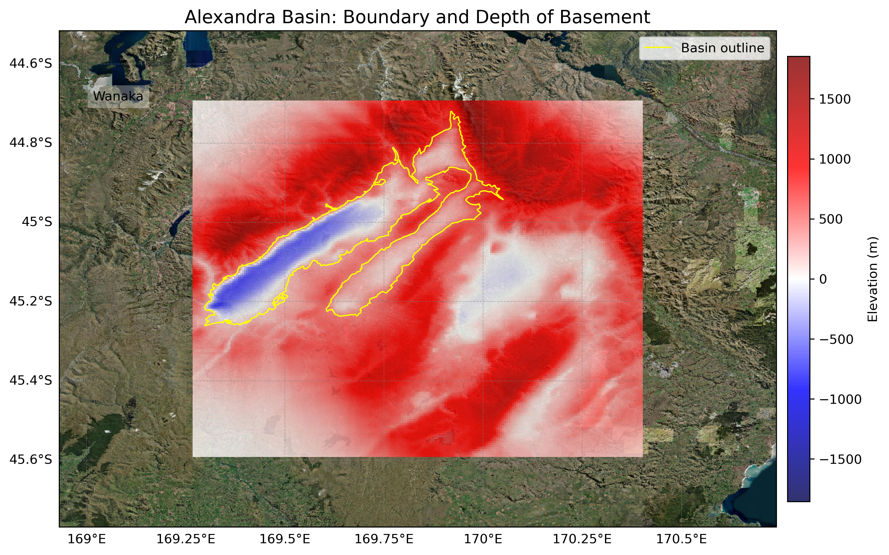
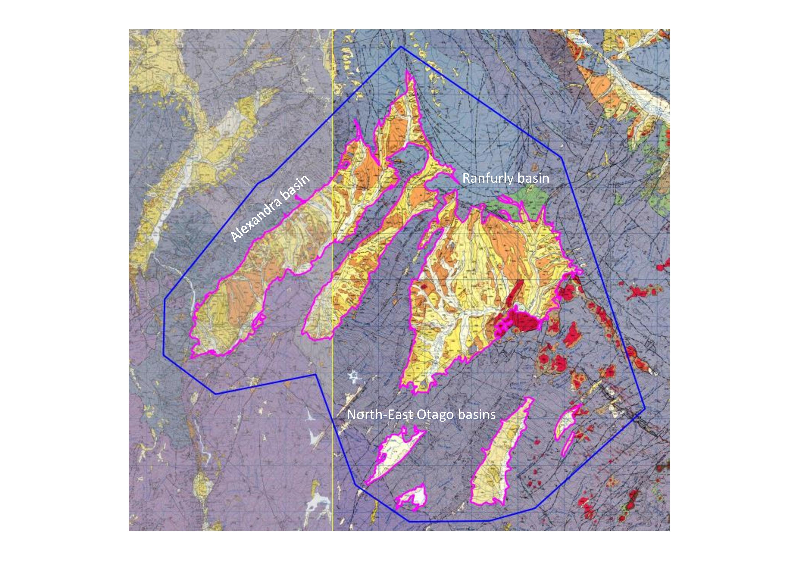

# Basin : Alexandra

## Overview
|         |                     |
|---------|---------------------|
| Version | 20p7           |
| Type    | 1        |
| Author  | Cameron Douglas (USER2020)            |
| Created | 2020-07           |

## Images

*Figure 1 Location*

*Figure 2 Alexandra Basin Map*

*Figure 3 Alexandra-ranfurly Basins Classification V2-page-001*

## Notes
- Alexandra, Ranfurly and NE_Otago share the same basement

## Data
### Boundaries
- Alexandra_outline_WGS84 : [GeoJSON](Alexandra_outline_WGS84.geojson)

### Surfaces
- NZ_DEM_HD :  (Submodel: canterbury1d_v2)
- Alexandra_basement_WGS84 : [HDF5](Alexandra_basement_WGS84.h5) (Submodel: N/A)

---
*Page generated on: September 23, 2025, 15:46 NZST/NZDT*
