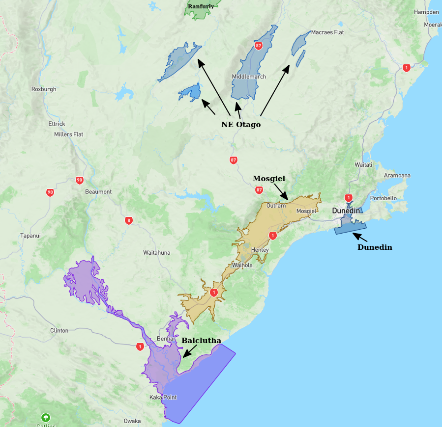
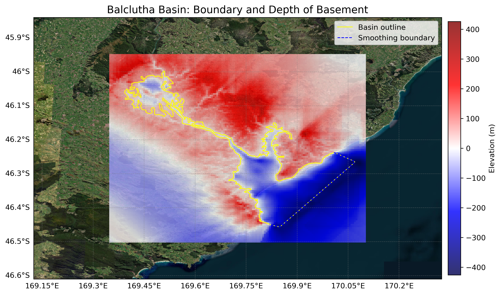

# Basin : Balclutha

## Overview
|         |                     |
|---------|---------------------|
| Version | 20p7           |
| Type    | 1        |
| Author  | Cameron Douglas (USER2020)            |
| Created | 2020-07           |

## Images

*Figure 1 Location*

*Figure 2 Balclutha Basin Map*

*Figure 3 Green Class*

*Figure 4 Green Rock*

## Notes
- Green area (in green_rock.png) tentatively regarded as a sedimentary rock (soft rock)
- Implemented as two separate basins (Mosgiel/Balclutha) joined by the sedimentary rock
- May need more rigorous classification

## Data
### Boundaries
- Balclutha_outline_WGS84 : [GeoJSON](regional/Balclutha/Balclutha_outline_WGS84.geojson)

### Surfaces
- NZ_DEM_HD : [HDF5](global/surface/NZ_DEM_HD.h5) (Submodel: canterbury1d_v2)
- Balclutha_basement_WGS84 : [HDF5](regional/Balclutha/Balclutha_basement_WGS84.h5) (Submodel: N/A)

### Smoothing Boundaries
- [Balclutha_smoothing.txt](regional/Balclutha/Balclutha_smoothing.txt)

---
*Page generated on: September 02, 2025, 12:43 NZST/NZDT*
