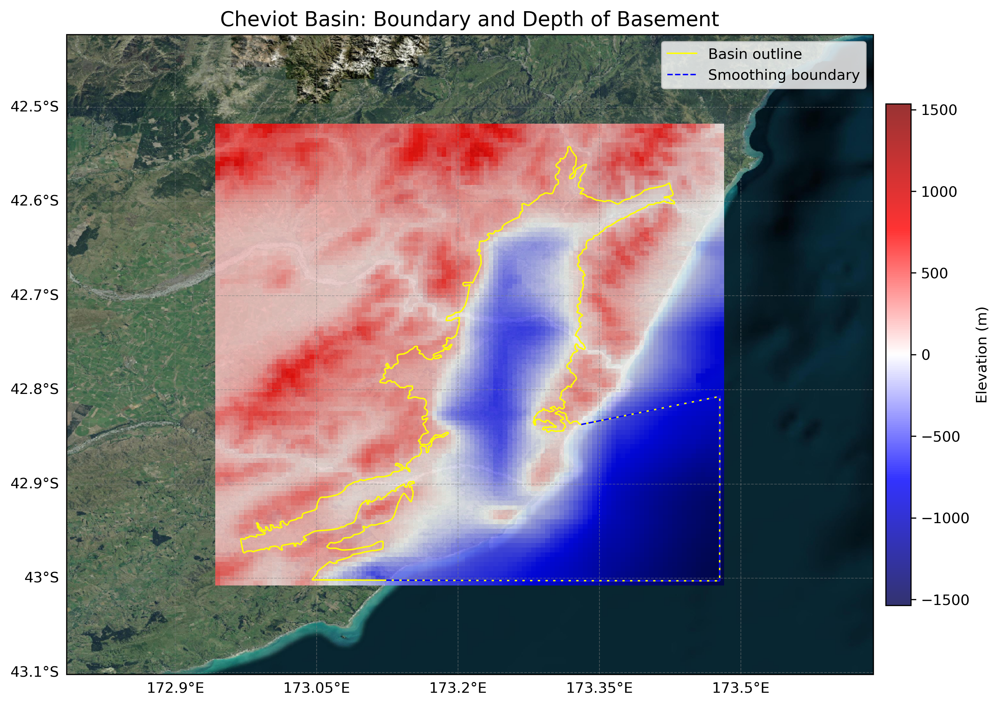

# Basin : Cheviot

## Overview
|         |                     |
|---------|---------------------|
| Version | 19p1           |
| Type    | 1        |
| Author  | Robin Lee            |
| Created | 2019-01           |

## Images

*Figure 1 Location*

*Figure 2 Cheviot Basin Map*

## Data
### Boundaries
- Cheviot_outline_WGS84 : [GeoJSON](Cheviot_outline_WGS84.geojson)

### Surfaces
- NZ_DEM_HD :  (Submodel: canterbury1d_v2)
- Cheviot_basement_WGS84 : [HDF5](Cheviot_basement_WGS84.h5) (Submodel: N/A)

### Smoothing Boundaries
- [Cheviot_smoothing.txt](Cheviot_smoothing.txt)

---
*Page generated on: September 23, 2025, 15:46 NZST/NZDT*
