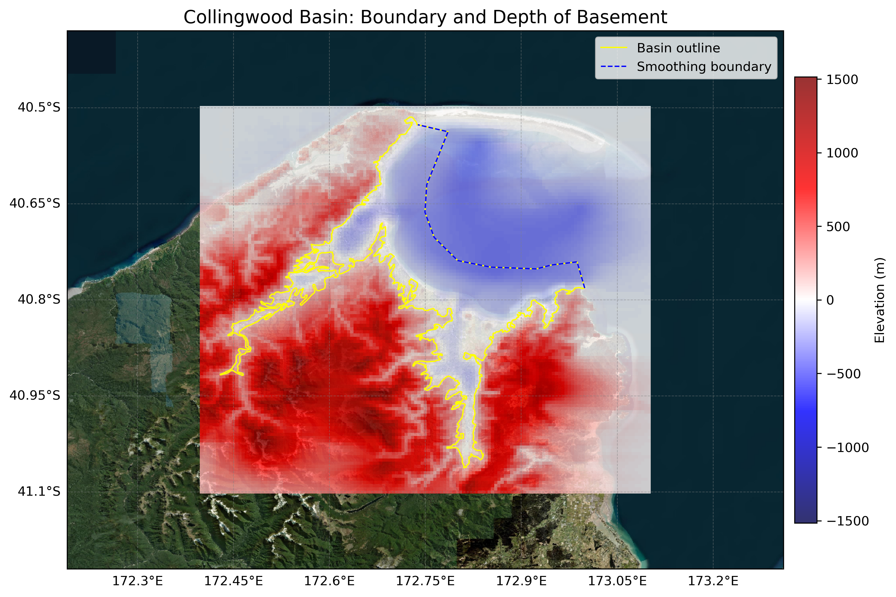

# Basin : Collingwood

## Overview
|         |                     |
|---------|---------------------|
| Version | 20p11           |
| Type    | 1        |
| Author  | Tim Tuckey (USER2020)            |
| Created | 2020-11           |

## Images

*Figure 1 Location*

*Figure 2 Collingwood Basin Map*

## Data
### Boundaries
- Collingwood_outline_WGS84_1 : [GeoJSON](Collingwood_outline_WGS84_1.geojson)
- Collingwood_outline_WGS84_2 : [GeoJSON](Collingwood_outline_WGS84_2.geojson)
- Collingwood_outline_WGS84_3 : [GeoJSON](Collingwood_outline_WGS84_3.geojson)

### Surfaces
- NZ_DEM_HD :  (Submodel: canterbury1d_v2)
- Collingwood_basement_WGS84 : [HDF5](Collingwood_basement_WGS84.h5) (Submodel: N/A)

### Smoothing Boundaries
- [Collingwood_smoothing.txt](Collingwood_smoothing.txt)

---
*Page generated on: September 26, 2025, 13:55 NZST/NZDT*
