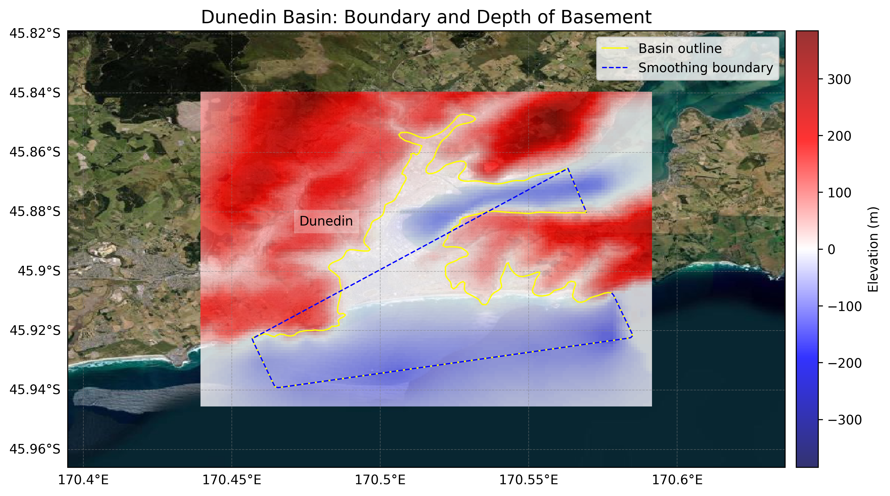
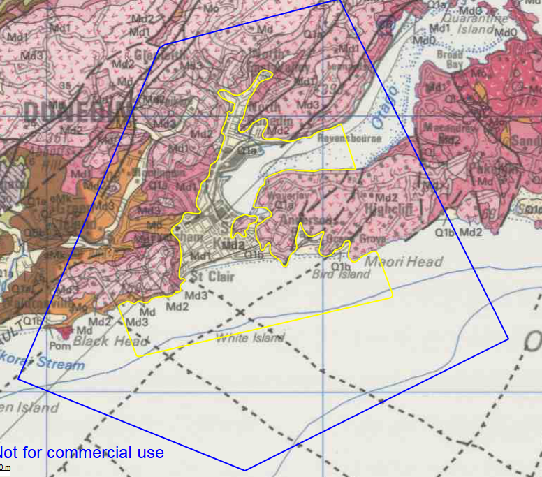

# Basin : Dunedin

## Overview
|         |                     |
|---------|---------------------|
| Version | 20p7           |
| Type    | 1        |
| Author  | Cameron Douglas (USER2020)            |
| Created | 2020-07           |

## Images

*Figure 1 Location*

*Figure 2 Dunedin Basin Map*

*Figure 3 Dunedin Outline*

## Notes
- Port Chalmers needs an update.
- Inlets need to be modelled.

## Data
### Boundaries
- Dunedin_outline_WGS84 : [GeoJSON](regional/Dunedin/Dunedin_outline_WGS84.geojson)

### Surfaces
- NZ_DEM_HD : [HDF5](global/surface/NZ_DEM_HD.h5) (Submodel: canterbury1d_v2)
- Dunedin_basement_WGS84 : [HDF5](regional/Dunedin/Dunedin_basement_WGS84.h5) (Submodel: N/A)

### Smoothing Boundaries
- [Dunedin_smoothing.txt](regional/Dunedin/Dunedin_smoothing.txt)

---
*Page generated on: September 02, 2025, 12:43 NZST/NZDT*
