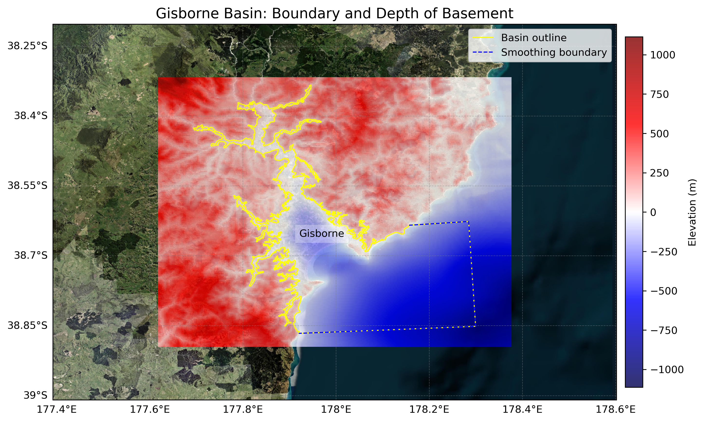

# Basin : Gisborne

## Overview
|         |                     |
|---------|---------------------|
| Version | 21p11           |
| Type    | 1        |
| Author  | William Lee (USER2021)            |
| Created | 2021-11           |

## Images

*Figure 1 Location*

*Figure 2 Gisborne Basin Map*

*Figure 3 Grisborne Basement*

## Notes
- (Comment from the author)
- Stop at Moto River, working around the East Cape from Gisborne. Haurere Point should be included in Whakatane

## Data
### Boundaries
- Gisborne_outline_WGS84 : [GeoJSON](Gisborne_outline_WGS84.geojson)

### Surfaces
- NZ_DEM_HD :  (Submodel: canterbury1d_v2)
- Gisborne_basement_WGS84 : [HDF5](Gisborne_basement_WGS84.h5) (Submodel: N/A)

### Smoothing Boundaries
- [Gisborne_smoothing.txt](Gisborne_smoothing.txt)

---
*Page generated on: September 23, 2025, 15:46 NZST/NZDT*
