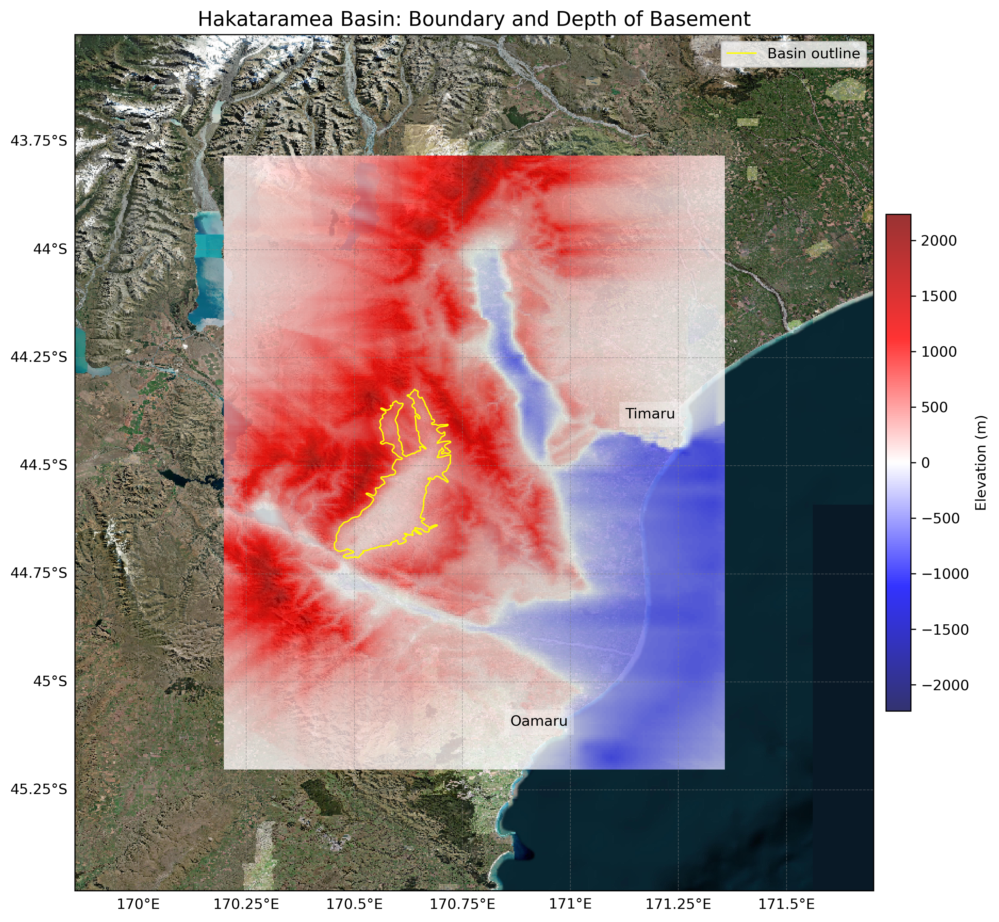
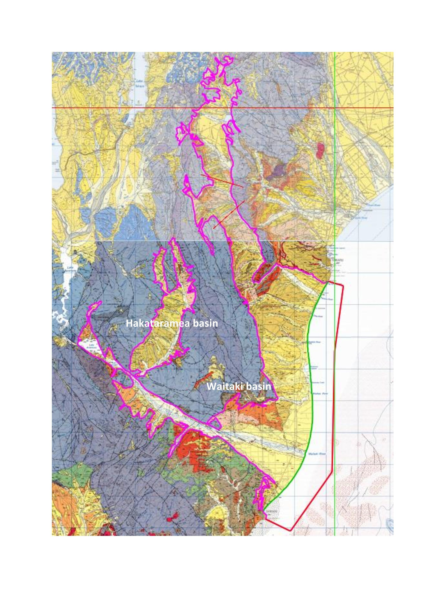

# Basin : Hakataramea

## Overview
|         |                     |
|---------|---------------------|
| Version | 20p8           |
| Type    | 1        |
| Author  | Cameron Douglas (USER2020)            |
| Created | 2020-08           |

## Images

*Figure 1 Location*

*Figure 2 Hakataramea Basin Map*

*Figure 3 Waitaki Hakataramea Outline*

## Notes
- Hakataramea and Waitaki share the same basement data.

## Data
### Boundaries
- Hakataramea_outline_WGS84 : [GeoJSON](Hakataramea_outline_WGS84.geojson)

### Surfaces
- NZ_DEM_HD :  (Submodel: canterbury1d_v2)
- Hakataramea_basement_WGS84 : [HDF5](Hakataramea_basement_WGS84.h5) (Submodel: N/A)

---
*Page generated on: September 23, 2025, 15:46 NZST/NZDT*
