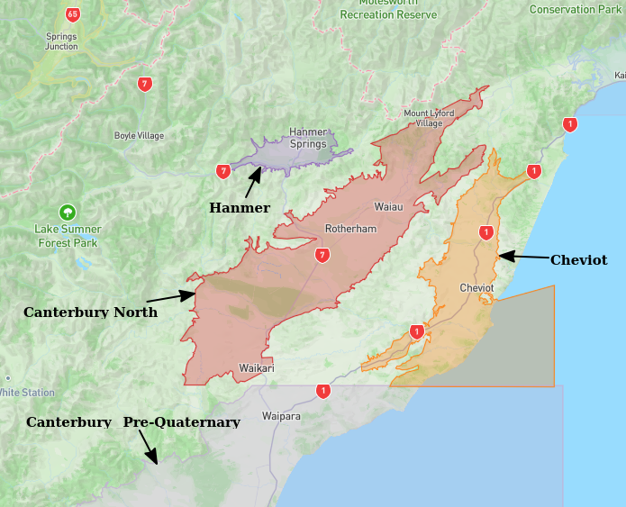
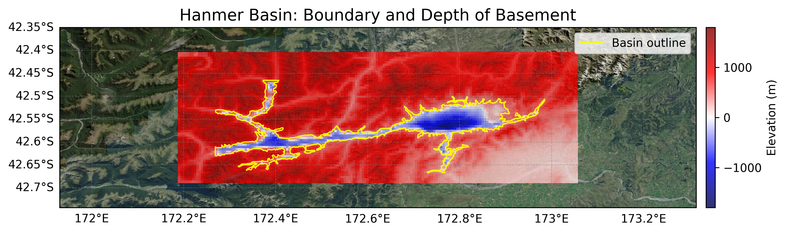
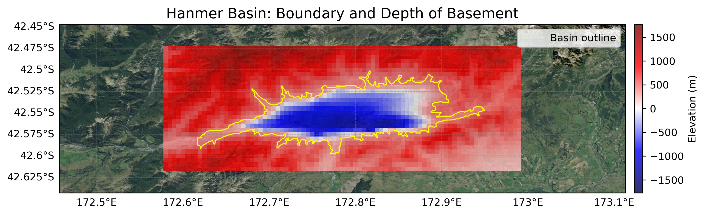
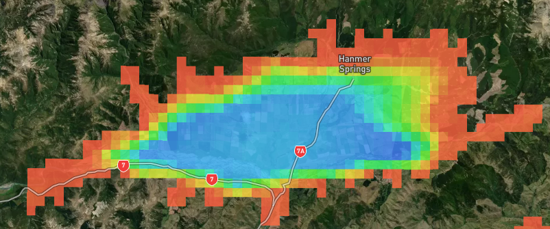

# Basin : Hanmer

## Overview
|         |                     |
|---------|---------------------|
| Version | 25p3           |
| Type    | 1        |
| Author  | Ayushi Tiwari / Robin Lee            |
| Created | 2025-03           |
| Older Versions | 19p1 |

## Images

*Figure 1 Location*

*Figure 2 Hanmer Basin Map V25p3*

## Data
### Boundaries
- Hanmer_outline_WGS84_v25p3 : [GeoJSON](Hanmer_outline_WGS84_v25p3.geojson)

### Surfaces
- NZ_DEM_HD :  (Submodel: canterbury1d_v2)
- Hanmer_basement_WGS84_v25p3 : [HDF5](Hanmer_basement_WGS84_v25p3.h5) (Submodel: N/A)

## Older Versions

### 19p1

|         |                     |
|---------|---------------------|
| Version | 19p1  |
| Type    | 1 |
| Author  | Robin Lee |
| Created | 2019-01       |

**Images:**

*Figure 1 Location*

*Figure 2 Hanmer Basement*

**Data:**
*Boundaries:*
- Hanmer_outline_WGS84_v19p1 : [GeoJSON](Hanmer_outline_WGS84_v19p1.geojson)

*Surfaces:*
- NZ_DEM_HD :  (Submodel: canterbury1d_v2)
- Hanmer_basement_WGS84_v19p1 : [HDF5](Hanmer_basement_WGS84_v19p1.h5) (Submodel: N/A)

---
*Page generated on: September 23, 2025, 15:46 NZST/NZDT*
