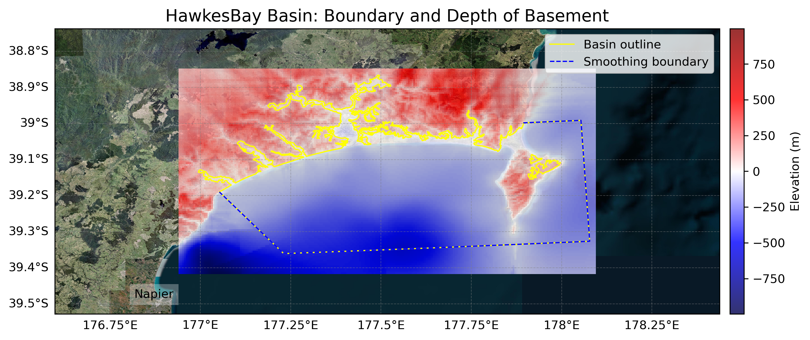
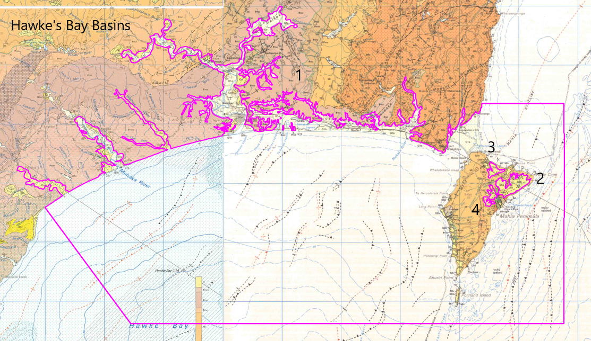
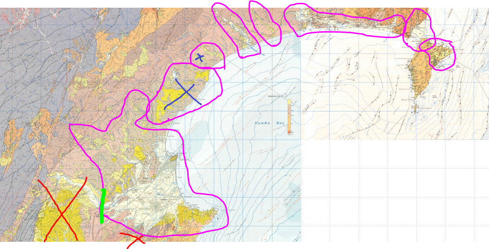

# Basin : HawkesBay

## Overview
|         |                     |
|---------|---------------------|
| Version | 21p7           |
| Type    | 1        |
| Author  | William Lee (USER2021)            |
| Created | 2021-07           |

## Images

*Figure 1 Location*

*Figure 2 Hawkesbay Basin Map*

*Figure 3 Hawkes Bay Outline*

*Figure 4 Hawkes Bay Outline Edited*

## Notes
- (Comment from the author) "The areas marked with black X's were either considered too shallow or sedimentary rock so weren't modelled as a basin."

## Data
### Boundaries
- HawkesBay_outline_WGS84_1 : [GeoJSON](HawkesBay_outline_WGS84_1.geojson)
- HawkesBay_outline_WGS84_2 : [GeoJSON](HawkesBay_outline_WGS84_2.geojson)
- HawkesBay_outline_WGS84_3 : [GeoJSON](HawkesBay_outline_WGS84_3.geojson)
- HawkesBay_outline_WGS84_4 : [GeoJSON](HawkesBay_outline_WGS84_4.geojson)

### Surfaces
- NZ_DEM_HD :  (Submodel: canterbury1d_v2)
- HawkesBay_basement_WGS84 : [HDF5](HawkesBay_basement_WGS84.h5) (Submodel: N/A)

### Smoothing Boundaries
- [HawkesBay_smoothing.txt](HawkesBay_smoothing.txt)

---
*Page generated on: September 23, 2025, 15:46 NZST/NZDT*
