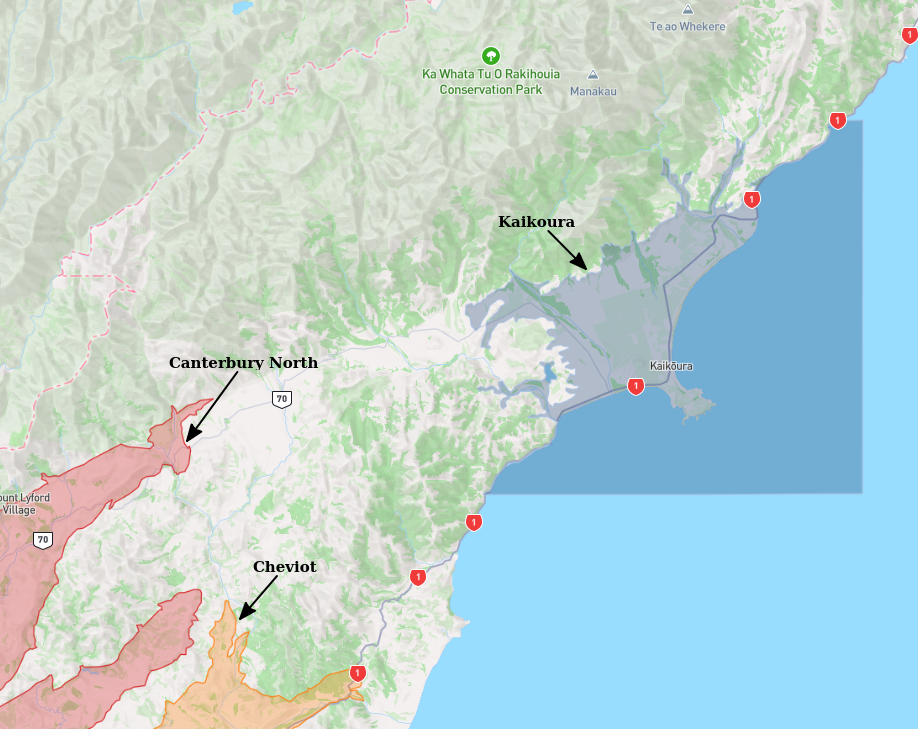
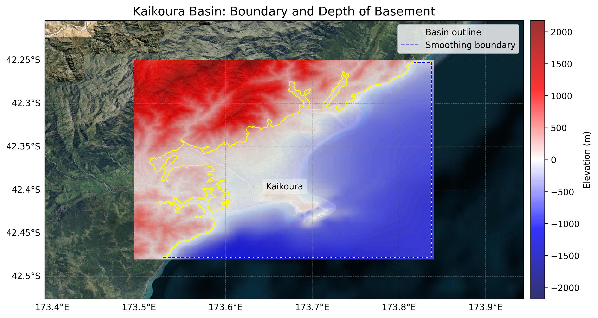
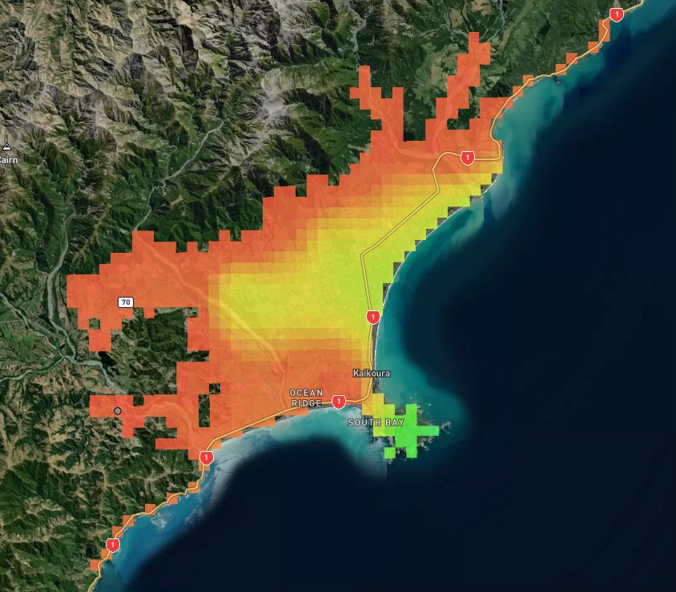
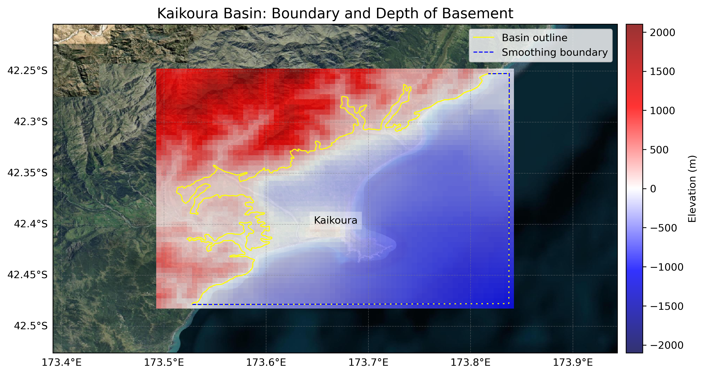

# Basin : Kaikoura

## Overview
|         |                     |
|---------|---------------------|
| Version | 25p5           |
| Type    | 2        |
| Author  | Robin Lee            |
| Created | 2025-05           |
| Older Versions | 19p1 |

## Images

*Figure 1 Location*

*Figure 2 Kaikoura Basin Map V25p5*

*Figure 3 Kaikoura Basement*

## Data
### Boundaries
- Kaikoura_outline_WGS84_v25p5 : [GeoJSON](Kaikoura_outline_WGS84_v25p5.geojson)

### Surfaces
- NZ_DEM_HD :  (Submodel: canterbury1d_v2)
- Kaikoura_basement_WGS84_v25p5 : [HDF5](Kaikoura_basement_WGS84_v25p5.h5) (Submodel: N/A)

### Smoothing Boundaries
- [Kaikoura_smoothing_v25p5.txt](Kaikoura_smoothing_v25p5.txt)

## Older Versions

### 19p1

|         |                     |
|---------|---------------------|
| Version | 19p1  |
| Type    | 2 |
| Author  | Robin Lee |
| Created | 2019-01       |

**Images:**

*Figure 1 Location*

**Data:**
*Boundaries:*
- Kaikoura_outline_WGS84 : [GeoJSON](Kaikoura_outline_WGS84.geojson)

*Surfaces:*
- NZ_DEM_HD :  (Submodel: canterbury1d_v2)
- Kaikoura_basement_WGS84 : [HDF5](Kaikoura_basement_WGS84.h5) (Submodel: N/A)

*Smoothing Boundaries:*
- [Kaikoura_smoothing.txt](Kaikoura_smoothing.txt)

---
*Page generated on: September 26, 2025, 13:55 NZST/NZDT*
