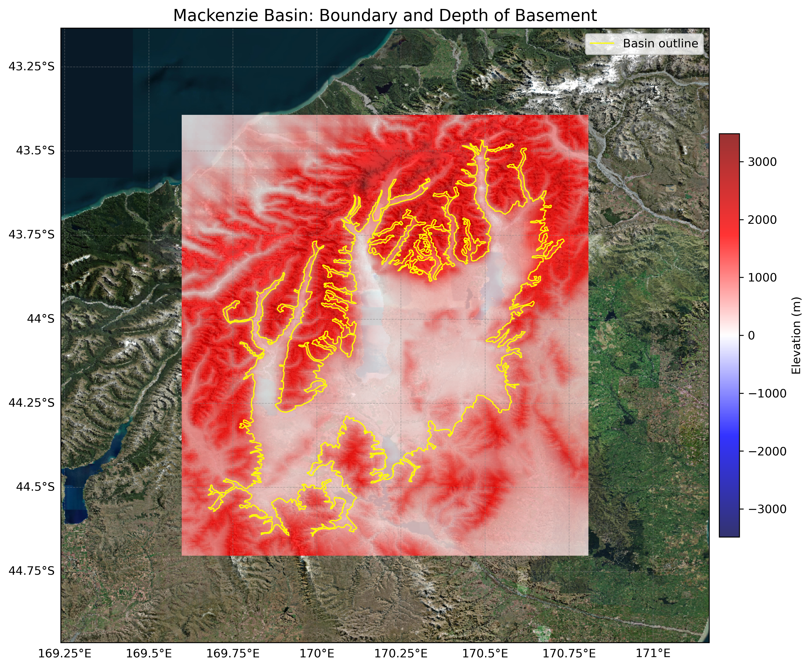
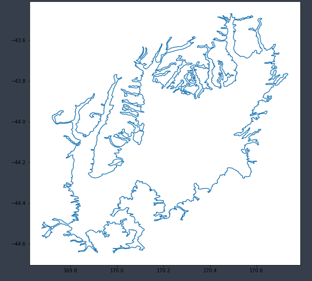

# Basin : Mackenzie

## Overview
|         |                     |
|---------|---------------------|
| Version | 20p6           |
| Type    | 1        |
| Author  | Cameron Douglas (USER2020)            |
| Created | 2020-06           |

## Images

*Figure 1 Location*

*Figure 2 Mackenzie Basin Map*

*Figure 3 Mackenzie Boundary*

## Data
### Boundaries
- Mackenzie_outline_WGS84 : [GeoJSON](Mackenzie_outline_WGS84.geojson)

### Surfaces
- NZ_DEM_HD :  (Submodel: canterbury1d_v2)
- Mackenzie_basement_WGS84 : [HDF5](Mackenzie_basement_WGS84.h5) (Submodel: N/A)

---
*Page generated on: September 23, 2025, 15:46 NZST/NZDT*
