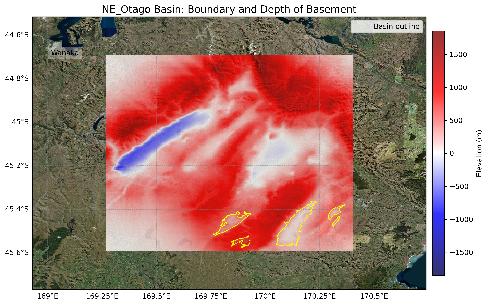
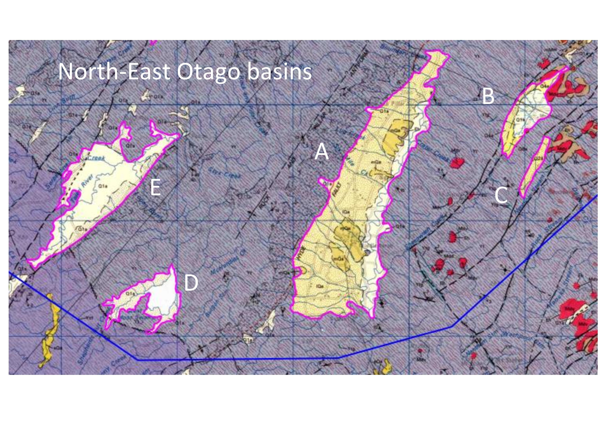

# Basin : NE_Otago

## Overview
|         |                     |
|---------|---------------------|
| Version | 20p7           |
| Type    | 1        |
| Author  | Cameron Douglas (USER2020)            |
| Created | 2020-07           |

## Images

*Figure 1 Location*

*Figure 2 Ne Otago Basin Map*

*Figure 3 Ne Otago Basins Classification-page-001*

## Notes
- Alexandra, Ranfurly and NE_Otago share the same basement

## Data
### Boundaries
- NE_Otago_outline_WGS84_1 : [GeoJSON](NE_Otago_outline_WGS84_1.geojson)
- NE_Otago_outline_WGS84_2 : [GeoJSON](NE_Otago_outline_WGS84_2.geojson)
- NE_Otago_outline_WGS84_3 : [GeoJSON](NE_Otago_outline_WGS84_3.geojson)
- NE_Otago_outline_WGS84_4 : [GeoJSON](NE_Otago_outline_WGS84_4.geojson)
- NE_Otago_outline_WGS84_5 : [GeoJSON](NE_Otago_outline_WGS84_5.geojson)

### Surfaces
- NZ_DEM_HD :  (Submodel: canterbury1d_v2)
- NE_Otago_basement_WGS84 : [HDF5](NE_Otago_basement_WGS84.h5) (Submodel: N/A)

---
*Page generated on: September 26, 2025, 13:55 NZST/NZDT*
