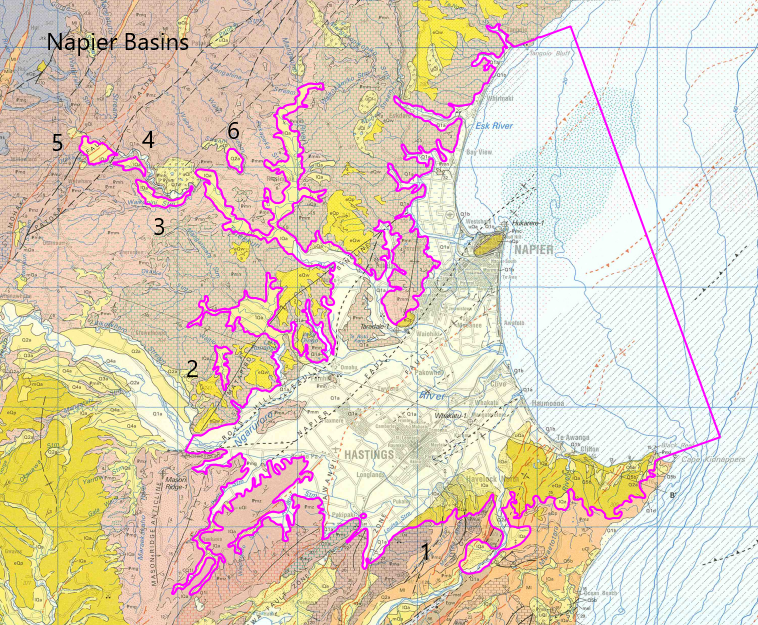

# Basin : Napier

## Overview
|         |                     |
|---------|---------------------|
| Version | 21p7           |
| Type    | 1        |
| Author  | William Lee (USER2021)            |
| Created | 2021-07           |

## Images

*Figure 1 Location*

*Figure 2 Napier Basin Map*

*Figure 3 Napier Outline*

## Data
### Boundaries
- Napier_outline_WGS84_1 : [GeoJSON](Napier_outline_WGS84_1.geojson)
- Napier_outline_WGS84_2 : [GeoJSON](Napier_outline_WGS84_2.geojson)
- Napier_outline_WGS84_3 : [GeoJSON](Napier_outline_WGS84_3.geojson)
- Napier_outline_WGS84_4 : [GeoJSON](Napier_outline_WGS84_4.geojson)
- Napier_outline_WGS84_5 : [GeoJSON](Napier_outline_WGS84_5.geojson)
- Napier_outline_WGS84_6 : [GeoJSON](Napier_outline_WGS84_6.geojson)

### Surfaces
- NZ_DEM_HD :  (Submodel: canterbury1d_v2)
- Napier_basement_WGS84 : [HDF5](Napier_basement_WGS84.h5) (Submodel: N/A)

### Smoothing Boundaries
- [Napier_smoothing.txt](Napier_smoothing.txt)

---
*Page generated on: September 23, 2025, 15:46 NZST/NZDT*
