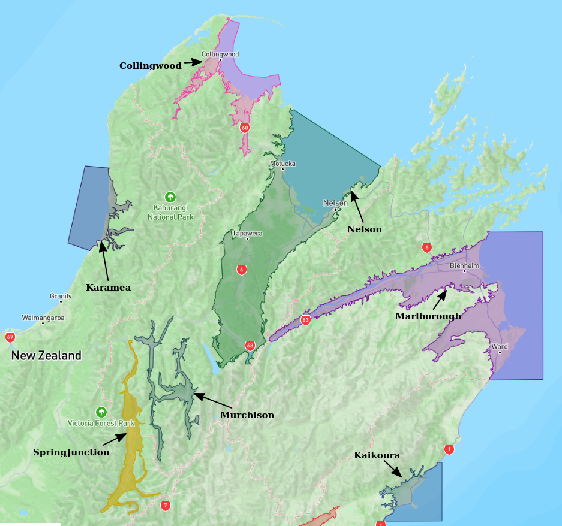
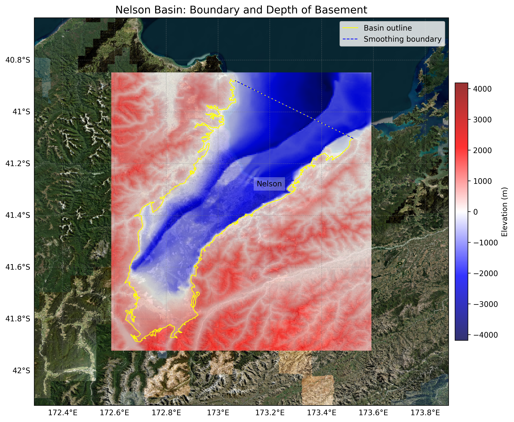
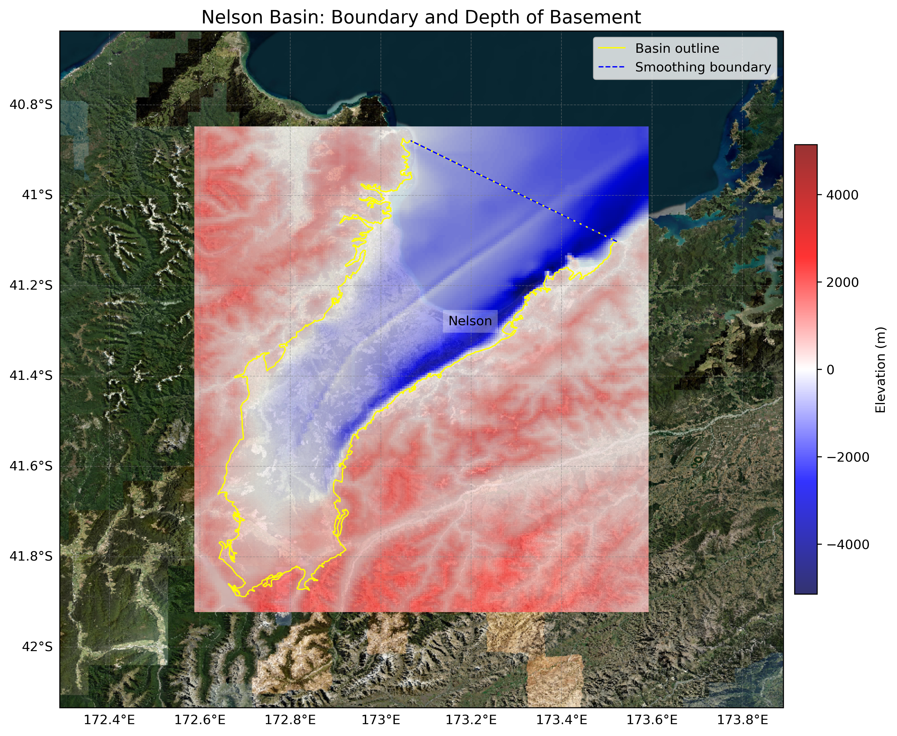

# Basin : Nelson

## Overview
|         |                     |
|---------|---------------------|
| Version | 25p5           |
| Type    | 2        |
| Author  | Robin Lee            |
| Created | 2025-05           |
| Older Versions | 19p1 |

## Images

*Figure 1 Location*

*Figure 2 Nelson Basin Map V25p5*

## Notes
- Sourced from https://nelson-richmond-geolmap.github.io/RGMap/ (for the geological map of the Nelson-Richmond area)
- Based on Ghisetti2017

## Data
### Boundaries
- Nelson_outline_WGS84 : [GeoJSON](regional/Nelson/Nelson_outline_WGS84.geojson)

### Surfaces
- NZ_DEM_HD : [HDF5](global/surface/NZ_DEM_HD.h5) (Submodel: canterbury1d_v2)
- Nelson_basement_WGS84_v25p5 : [HDF5](regional/Nelson/Nelson_basement_WGS84_v25p5.h5) (Submodel: N/A)

### Smoothing Boundaries
- [Nelson_smoothing.txt](regional/Nelson/Nelson_smoothing.txt)

## Older Versions

### 19p1

|         |                     |
|---------|---------------------|
| Version | 19p1  |
| Type    | 2 |
| Author  | Robin Lee |
| Created | 2019-01       |

**Images:**

*Figure 1 Location*

**Notes:**
- Sourced from https://nelson-richmond-geolmap.github.io/RGMap/ (for the geological map of the Nelson-Richmond area)

**Data:**
*Boundaries:*
- Nelson_outline_WGS84 : [GeoJSON](regional/Nelson/Nelson_outline_WGS84.geojson)

*Surfaces:*
- NZ_DEM_HD : [HDF5](global/surface/NZ_DEM_HD.h5) (Submodel: canterbury1d_v2)
- Nelson_basement_WGS84_v19p1 : [HDF5](regional/Nelson/Nelson_basement_WGS84_v19p1.h5) (Submodel: N/A)

*Smoothing Boundaries:*
- [Nelson_smoothing.txt](regional/Nelson/Nelson_smoothing.txt)

---
*Page generated on: September 02, 2025, 12:43 NZST/NZDT*
