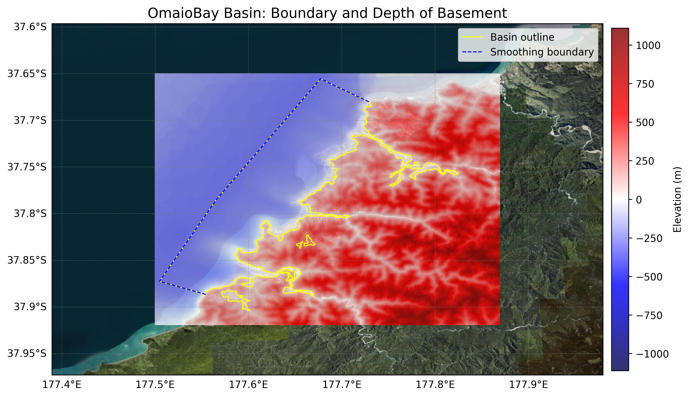
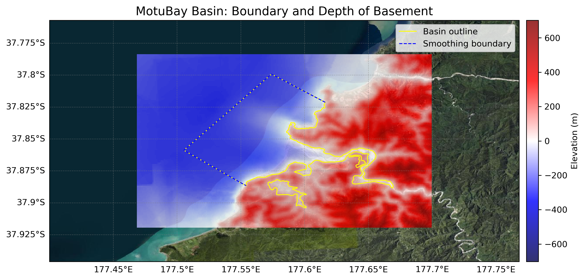

# Basin : OmaioBay

## Overview
|         |                     |
|---------|---------------------|
| Version | 25p5           |
| Type    | 1        |
| Author  | Cameron Davis / Emma Coumbe (USER2022)            |
| Created | 2025-05           |
| Older Versions | 22p3 |

## Images

*Figure 1 Location*

*Figure 2 Omaiobay Basin Map*

*Figure 3 Moturiver Extended Outline*

*Figure 4 Eastcape Coastal River Valleys*

## Data
### Boundaries
- OmaioBay_outline_WGS84_1 : [GeoJSON](OmaioBay_outline_WGS84_1.geojson)
- OmaioBay_outline_WGS84_2 : [GeoJSON](OmaioBay_outline_WGS84_2.geojson)
- OmaioBay_outline_WGS84_3 : [GeoJSON](OmaioBay_outline_WGS84_3.geojson)
- OmaioBay_outline_WGS84_4 : [GeoJSON](OmaioBay_outline_WGS84_4.geojson)
- OmaioBay_outline_WGS84_5 : [GeoJSON](OmaioBay_outline_WGS84_5.geojson)

### Surfaces
- NZ_DEM_HD :  (Submodel: canterbury1d_v2)
- OmaioBay_basement_WGS84 : [HDF5](OmaioBay_basement_WGS84.h5) (Submodel: N/A)

### Smoothing Boundaries
- [OmaioBay_smoothing.txt](OmaioBay_smoothing.txt)

## Older Versions

### 22p3

|         |                     |
|---------|---------------------|
| Version | 22p3  |
| Type    | 1 |
| Author  | Cameron Davis / Emma Coumbe (USER2022) |
| Created | 2022-03       |

**Images:**

*Figure 1 Location*

**Notes:**
- Renamed from MotuBay_v22p3
- Rest of the coastal river valleys on the East Cape (Waiapu River, Hicks Bay, Waihau Bay, Motu River) to be added
- Tolaga bay/Omaio Bay to be included (pending acceptance) https://github.com/ucgmsim/Velocity-Model/pull/43/files

**Data:**
*Boundaries:*
- OmaioBay_outline_WGS84_v22p3_1 : [GeoJSON](OmaioBay_outline_WGS84_v22p3_1.geojson)
- OmaioBay_outline_WGS84_v22p3_2 : [GeoJSON](OmaioBay_outline_WGS84_v22p3_2.geojson)
- OmaioBay_outline_WGS84_v22p3_3 : [GeoJSON](OmaioBay_outline_WGS84_v22p3_3.geojson)

*Surfaces:*
- NZ_DEM_HD :  (Submodel: canterbury1d_v2)
- OmaioBay_basement_WGS84_v22p3 : [HDF5](OmaioBay_basement_WGS84_v22p3.h5) (Submodel: N/A)

*Smoothing Boundaries:*
- [OmaioBay_smoothing_v22p3.txt](OmaioBay_smoothing_v22p3.txt)

---
*Page generated on: September 26, 2025, 13:55 NZST/NZDT*
