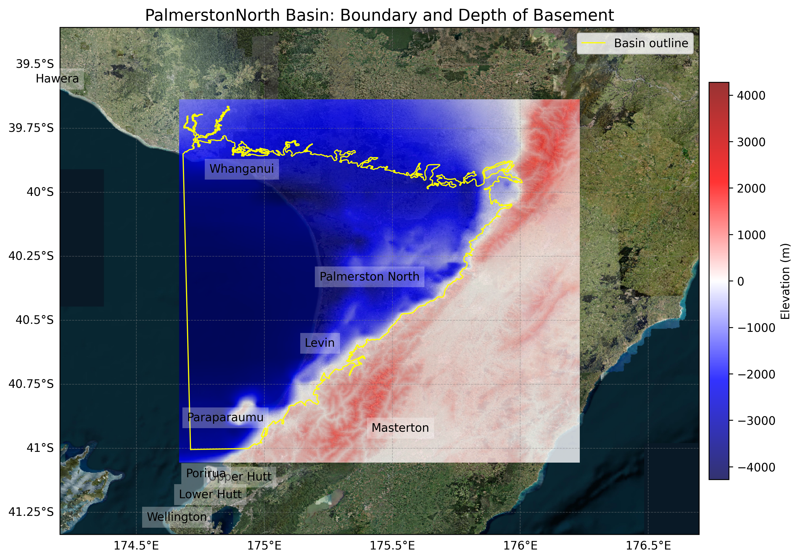
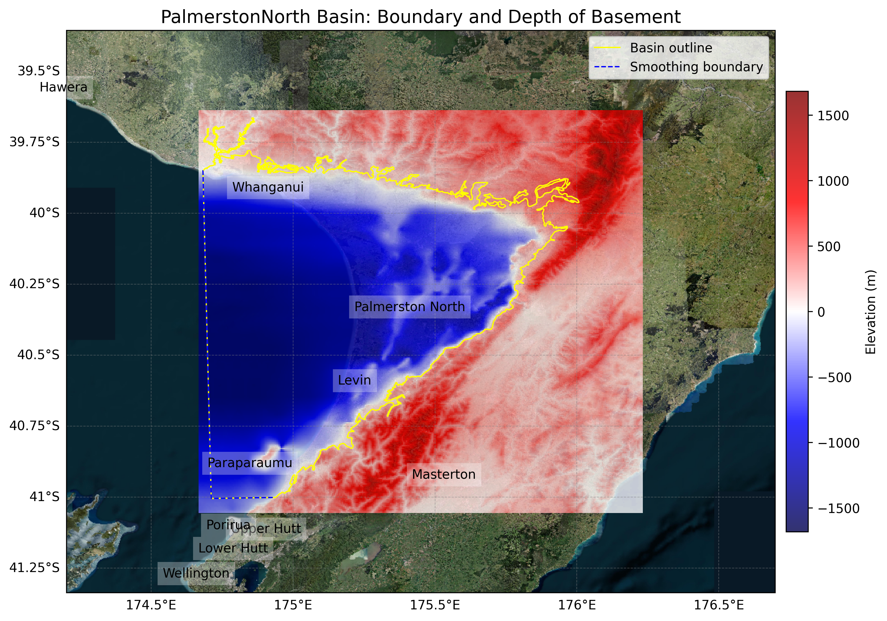

# Basin : PalmerstonNorth

## Overview
|         |                     |
|---------|---------------------|
| Version | 25p8           |
| Type    | 1        |
| Author  | Ayushi Tiwari            |
| Created | 2025-08           |
| Older Versions | 25p5 |

## Images

*Figure 1 Location*

## Data
### Boundaries
- PalmerstonNorth_outline_WGS84 : [GeoJSON](PalmerstonNorth_outline_WGS84.geojson)

### Surfaces
- NZ_DEM_HD :  (Submodel: palmerstonnorth_v1)
- PalmerstonNorth_pliocenetop_WGS84_v25p8 : [HDF5](PalmerstonNorth_pliocenetop_WGS84_v25p8.h5) (Submodel: pn_pliocene_submod_v1)
- PalmerstonNorth_basement_WGS84_v25p8 : [HDF5](PalmerstonNorth_basement_WGS84_v25p8.h5) (Submodel: N/A)

### Smoothing Boundaries
- [PalmerstonNorth_smoothing.txt](PalmerstonNorth_smoothing.txt)

## Older Versions

### 25p5

|         |                     |
|---------|---------------------|
| Version | 25p5  |
| Type    | 1 |
| Author  | Ayushi Tiwari |
| Created | 2025-05       |

**Images:**

*Figure 1 Location*

**Data:**
*Boundaries:*
- PalmerstonNorth_outline_WGS84 : [GeoJSON](PalmerstonNorth_outline_WGS84.geojson)

*Surfaces:*
- NZ_DEM_HD :  (Submodel: canterbury1d_v2)
- PalmerstonNorth_basement_WGS84_v25p5 : [HDF5](PalmerstonNorth_basement_WGS84_v25p5.h5) (Submodel: N/A)

*Smoothing Boundaries:*
- [PalmerstonNorth_smoothing.txt](PalmerstonNorth_smoothing.txt)

---
*Page generated on: September 26, 2025, 13:55 NZST/NZDT*
