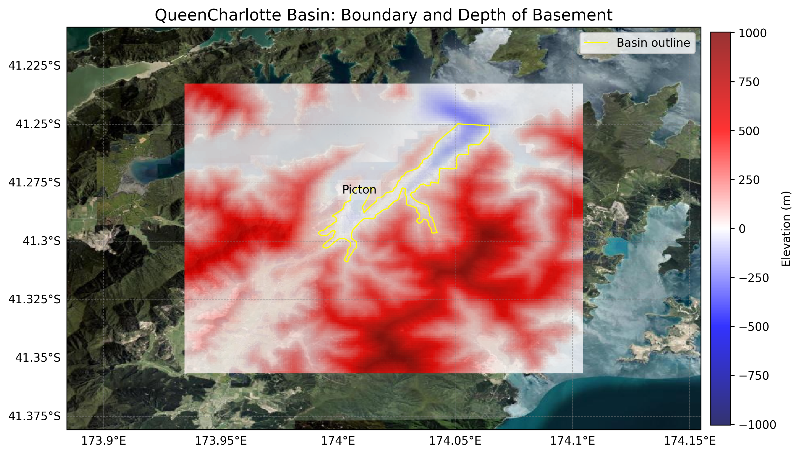

# Basin : QueenCharlotte

## Overview
|         |                     |
|---------|---------------------|
| Version | 25p8           |
| Type    | 1        |
| Author  | Ayushi Tiwari            |
| Created | 2025-08           |

## Images

*Figure 1 Location*

## Data
### Boundaries
- QueenCharlotte_outline_WGS84 : [GeoJSON](QueenCharlotte_outline_WGS84.geojson)

### Surfaces
- NZ_DEM_HD :  (Submodel: canterbury1d_v2)
- QueenCharlotte_basement_WGS84_v25p8 : [HDF5](QueenCharlotte_basement_WGS84_v25p8.h5) (Submodel: N/A)

---
*Page generated on: September 26, 2025, 13:55 NZST/NZDT*
