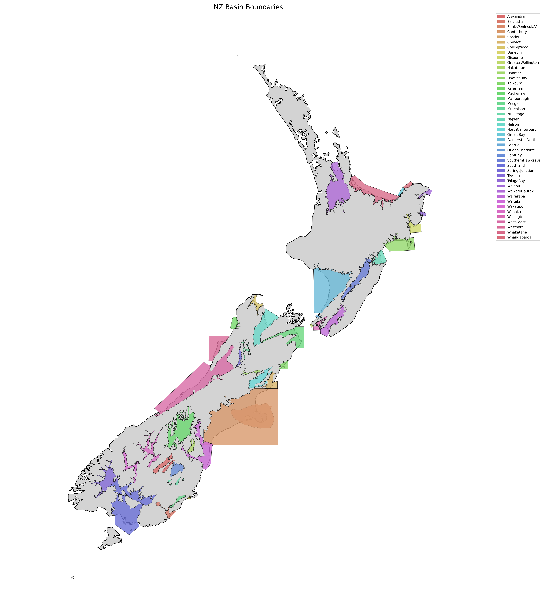

# Basins in the New Zealand Velocity Model (version 2.09)

This page provides an overview of sedimentary basin models integrated into the New Zealand Velocity Model.

<!-- Referenced map image -->

## Bay of Plenty Region
- [OmaioBay v25p5](OmaioBay/README.md)
- [Whakatane v25p8](Whakatane/README.md)
- [Whangaparoa v23p4](Whangaparoa/README.md)

## Canterbury Region
- [BanksPeninsulaVolcanics v19p1](BanksPeninsulaVolcanics/README.md)
- [Canterbury v19p1](Canterbury/README.md)
- [CastleHill v25p8](CastleHill/README.md)
- [Cheviot v19p1](Cheviot/README.md)
- [Hakataramea v20p8](Hakataramea/README.md)
- [Hanmer v25p3](Hanmer/README.md)
- [Kaikoura v25p5](Kaikoura/README.md)
- [Mackenzie v20p6](Mackenzie/README.md)
- [NorthCanterbury v25p8](NorthCanterbury/README.md)
- [Waitaki v20p8](Waitaki/README.md)

## Gisborne Region
- [Gisborne v21p11](Gisborne/README.md)
- [TolagaBay v25p5](TolagaBay/README.md)
- [Waiapu v25p5](Waiapu/README.md)

## Hawke's Bay Region
- [HawkesBay v21p7](HawkesBay/README.md)
- [Napier v21p7](Napier/README.md)

## Manawatū-Whanganui Region
- [PalmerstonNorth v25p8](PalmerstonNorth/README.md)
- [SouthernHawkesBay v21p12](SouthernHawkesBay/README.md)

## Marlborough Region
- [Marlborough v19p1](Marlborough/README.md)

## Otago Region
- [Alexandra v20p7](Alexandra/README.md)
- [Balclutha v20p7](Balclutha/README.md)
- [Dunedin v20p7](Dunedin/README.md)
- [Mosgiel v20p7](Mosgiel/README.md)
- [NE_Otago v20p7](NE_Otago/README.md)
- [Ranfurly v20p7](Ranfurly/README.md)
- [Wakatipu v20p7](Wakatipu/README.md)
- [Wanaka v20p6](Wanaka/README.md)

## Southland Region
- [Southland v25p5](Southland/README.md)
- [TeAnau v25p5](TeAnau/README.md)

## Tasman Region
- [Collingwood v20p11](Collingwood/README.md)
- [Murchison v20p7](Murchison/README.md)
- [Nelson v25p5](Nelson/README.md)

## Uncategorized
- [QueensCharlotte v25p8](QueensCharlotte/README.md)

## Waikato Region
- [WaikatoHauraki v19p7](WaikatoHauraki/README.md)

## Wellington Region
- [GreaterWellington v21p7](GreaterWellington/README.md)
- [Porirua v21p7](Porirua/README.md)
- [Wairarapa v21p12](Wairarapa/README.md)
- [Wellington v25p5](Wellington/README.md)

## West Coast Region
- [Karamea v20p11](Karamea/README.md)
- [SpringsJunction v20p11](SpringsJunction/README.md)
- [WestCoast v25p5](WestCoast/README.md)
- [Westport v25p5](Westport/README.md)

## Version Information

The version number in each basin name (e.g., v19p1) follows the format:
- Year (e.g., 19 = 2019)
- Point release (e.g., p1 = January)

Newer versions typically include refinements to basin geometry or velocity structure.
