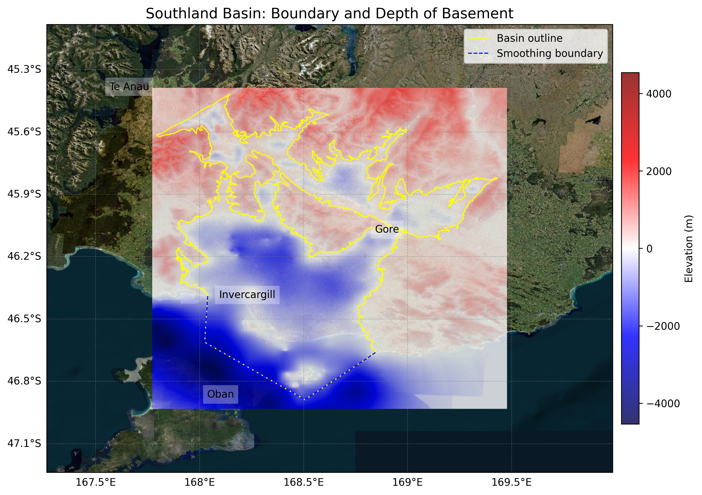

# Basin : Southland

## Overview
|         |                     |
|---------|---------------------|
| Version | 25p5           |
| Type    | 2        |
| Author  | Archie Goodrick            |
| Created | 2025-05           |

## Images

*Figure 1 Location*

## Data
### Boundaries
- Southland_outline_WGS84_1 : [GeoJSON](Southland_outline_WGS84_1.geojson)
- Southland_outline_WGS84_2 : [GeoJSON](Southland_outline_WGS84_2.geojson)

### Surfaces
- NZ_DEM_HD :  (Submodel: canterbury1d_v2)
- Southland_basement_WGS84 : [HDF5](Southland_basement_WGS84.h5) (Submodel: N/A)

### Smoothing Boundaries
- [Southland_smoothing.txt](Southland_smoothing.txt)

---
*Page generated on: September 26, 2025, 13:55 NZST/NZDT*
