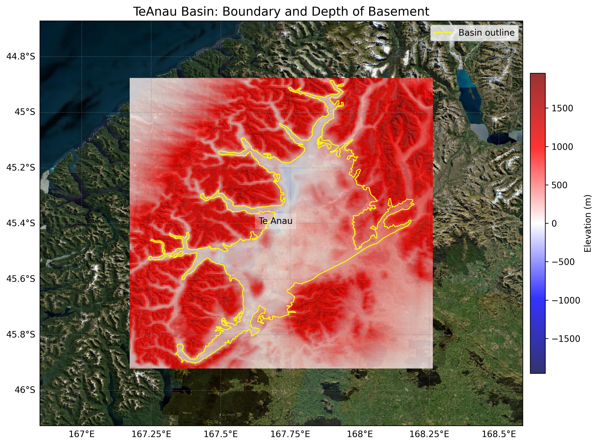

# Basin : TeAnau

## Overview
|         |                     |
|---------|---------------------|
| Version | 25p5           |
| Type    | 1        |
| Author  | Jackson Turner / Ayushi Tiwari (ENCN493)            |
| Created | 2025-05           |

## Images

*Figure 1 Location*

## Data
### Boundaries
- TeAnau_outline_WGS84 : [GeoJSON](TeAnau_outline_WGS84.geojson)

### Surfaces
- NZ_DEM_HD :  (Submodel: canterbury1d_v2)
- TeAnau_basement_WGS84 : [HDF5](TeAnau_basement_WGS84.h5) (Submodel: N/A)

---
*Page generated on: September 23, 2025, 15:46 NZST/NZDT*
