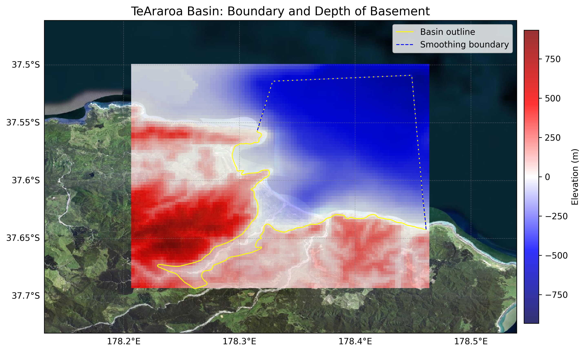

# Basin : TeAraroa

## Overview
|         |                     |
|---------|---------------------|
| Version | 25p9           |
| Type    | 1        |
| Author  | James Hoskin            |
| Created | 2025-09           |

## Images

*Figure 1 Location*

## Data
### Boundaries
- TeAraroa_outline_WGS84 : [GeoJSON](TeAraroa_outline_WGS84.geojson) / [TXT](TeAraroa_outline_WGS84.txt)

### Surfaces
- NZ_DEM_HD :  (Submodel: canterbury1d_v2)
- TeAraroa_basement_WGS84 : [HDF5](TeAraroa_basement_WGS84.h5) / [TXT](TeAraroa_basement_WGS84.in) (Submodel: N/A)

### Smoothing Boundaries
- [TeAraroa_smoothing.txt](TeAraroa_smoothing.txt)

---
*Page generated on: September 26, 2025, 16:09 NZST/NZDT*
