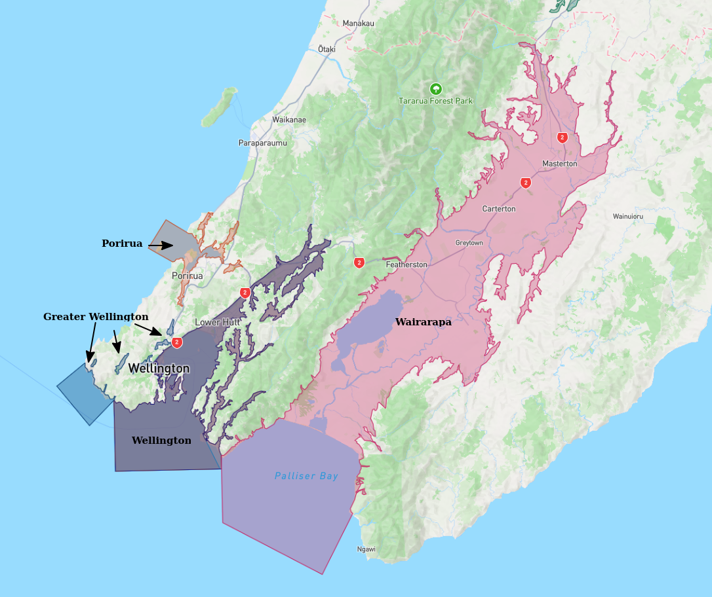
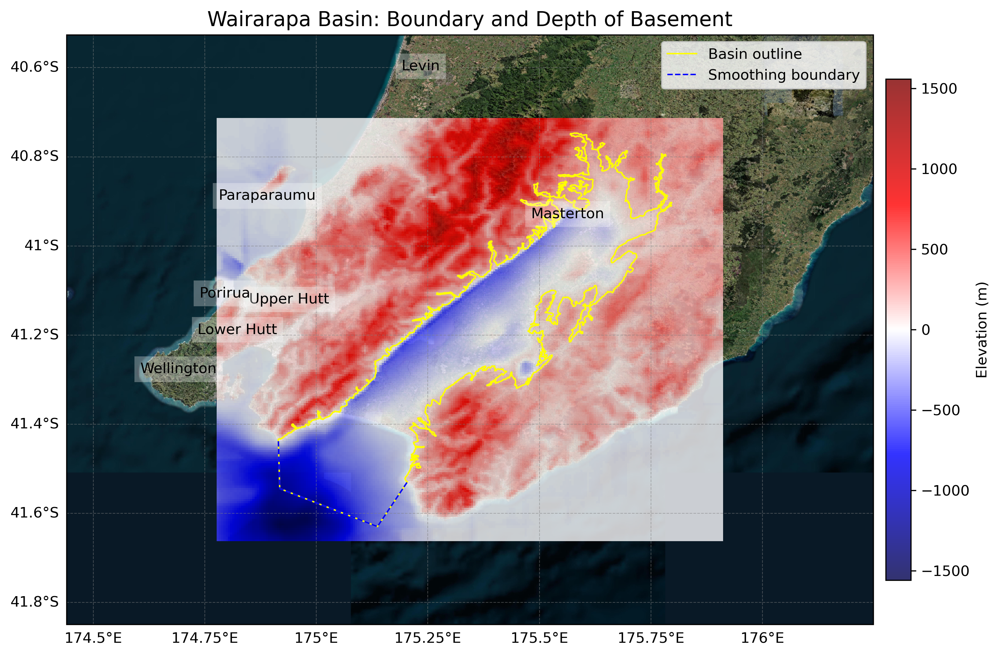

# Basin : Wairarapa

## Overview
|         |                     |
|---------|---------------------|
| Version | 21p12           |
| Type    | 1        |
| Author  | William Lee (USER2021)            |
| Created | 2021-12           |

## Images

*Figure 1 Location*

*Figure 2 Wairarapa Basin Map*

## Notes
- (Comment from the author) "Consider adding east coastal basins (e.g. Uruti Point)"

## Data
### Boundaries
- Wairarapa_outline_WGS84 : [GeoJSON](Wairarapa_outline_WGS84.geojson)

### Surfaces
- NZ_DEM_HD :  (Submodel: canterbury1d_v2)
- Wairarapa_basement_WGS84 : [HDF5](Wairarapa_basement_WGS84.h5) (Submodel: N/A)

### Smoothing Boundaries
- [Wairarapa_smoothing.txt](Wairarapa_smoothing.txt)

---
*Page generated on: September 26, 2025, 13:55 NZST/NZDT*
