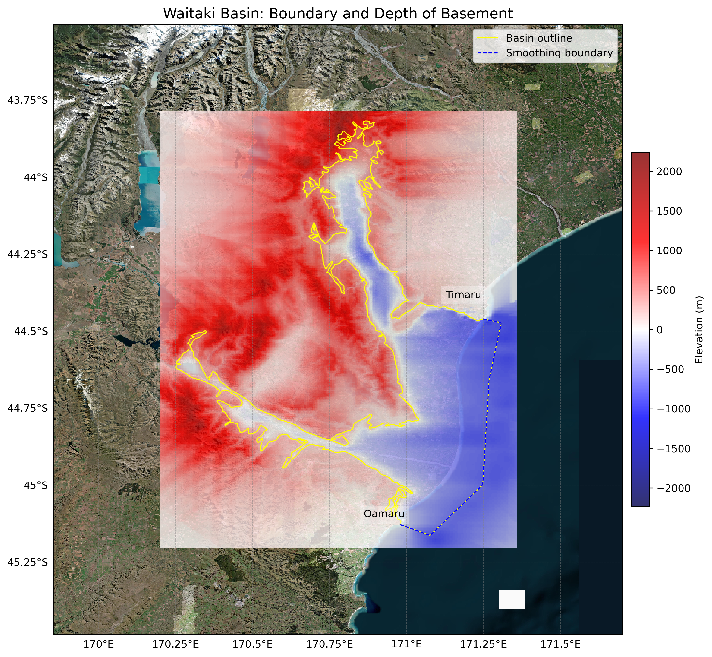

# Basin : Waitaki

## Overview
|         |                     |
|---------|---------------------|
| Version | 20p8           |
| Type    | 1        |
| Author  | Cameron Douglas (USER2020)            |
| Created | 2020-08           |

## Images

*Figure 1 Location*

*Figure 2 Waitaki Basin Map*

*Figure 3 Waitaki Hakataramea Outline*

## Notes
- (Comment from the author)
- Interacts with the boundary of the Canterbury Basin- Need to check boundary depth.
- Hakataramea and Waitaki share the same basement data.

## Data
### Boundaries
- Waitaki_outline_WGS84 : [GeoJSON](regional/Waitaki/Waitaki_outline_WGS84.geojson)

### Surfaces
- NZ_DEM_HD : [HDF5](global/surface/NZ_DEM_HD.h5) (Submodel: canterbury1d_v2)
- Waitaki_basement_WGS84 : [HDF5](regional/Waitaki/Waitaki_basement_WGS84.h5) (Submodel: N/A)

### Smoothing Boundaries
- [Waitaki_smoothing.txt](regional/Waitaki/Waitaki_smoothing.txt)

---
*Page generated on: September 02, 2025, 12:43 NZST/NZDT*
