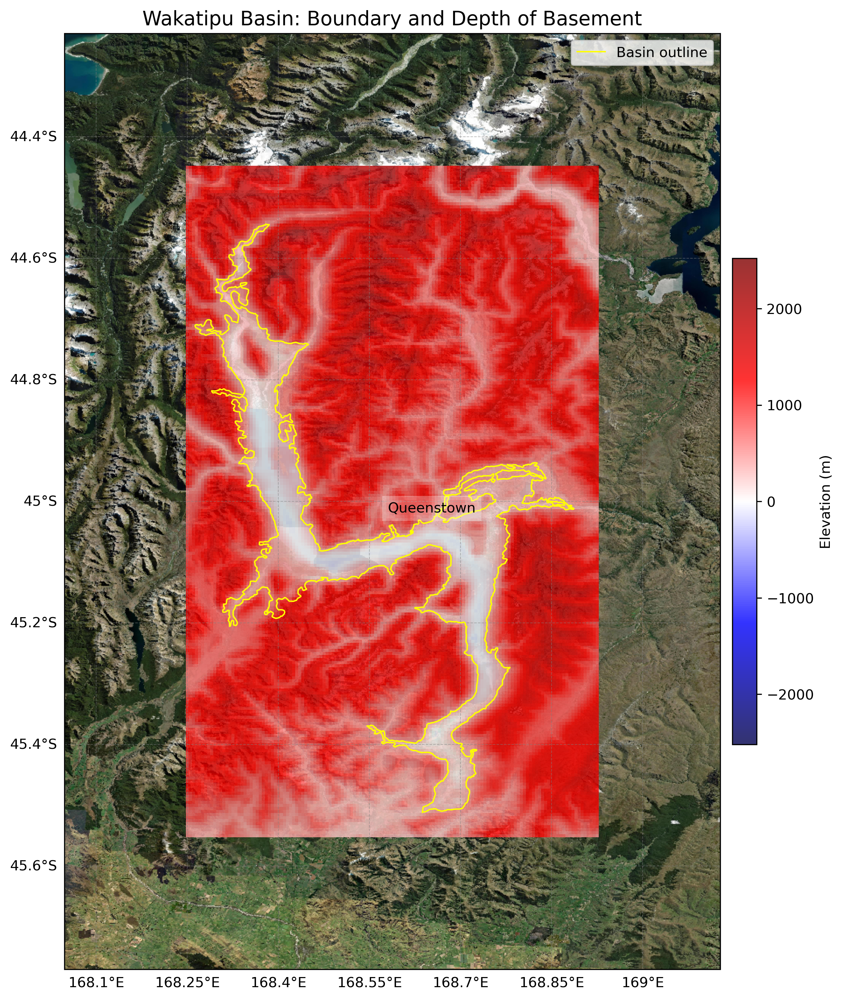

# Basin : Wakatipu

## Overview
|         |                     |
|---------|---------------------|
| Version | 20p7           |
| Type    | 1        |
| Author  | Tim Tuckey (USER2020)            |
| Created | 2020-07           |

## Images

*Figure 1 Location*

*Figure 2 Wakatipu Basin Map*

## Data
### Boundaries
- Wakatipu_outline_WGS84 : [GeoJSON](Wakatipu_outline_WGS84.geojson)

### Surfaces
- NZ_DEM_HD :  (Submodel: canterbury1d_v2)
- Wakatipu_basement_WGS84 : [HDF5](Wakatipu_basement_WGS84.h5) (Submodel: N/A)

---
*Page generated on: September 26, 2025, 13:55 NZST/NZDT*
