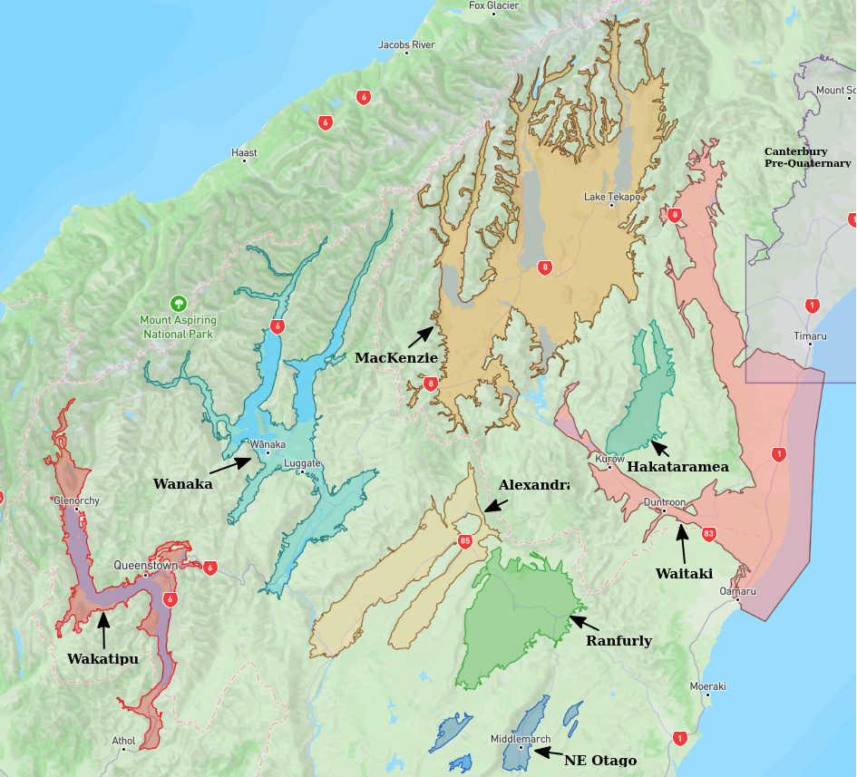
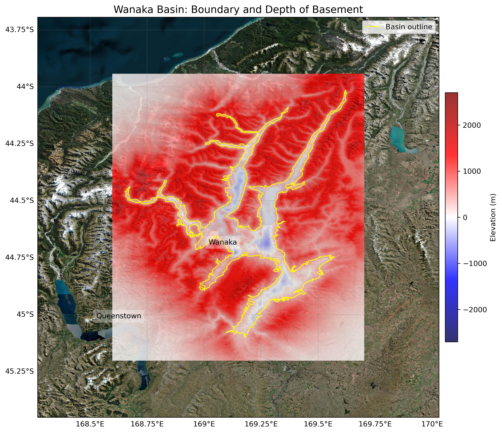
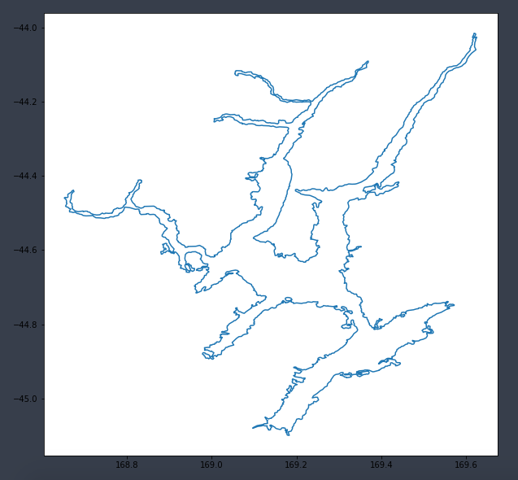

# Basin : Wanaka

## Overview
|         |                     |
|---------|---------------------|
| Version | 20p6           |
| Type    | 1        |
| Author  | Cameron Douglas (USER2020)            |
| Created | 2020-06           |

## Images

*Figure 1 Location*

*Figure 2 Wanaka Basin Map*

*Figure 3 Wanaka Boundary*

## Data
### Boundaries
- Wanaka_outline_WGS84 : [GeoJSON](regional/Wanaka/Wanaka_outline_WGS84.geojson)

### Surfaces
- NZ_DEM_HD : [HDF5](global/surface/NZ_DEM_HD.h5) (Submodel: canterbury1d_v2)
- Wanaka_basement_WGS84 : [HDF5](regional/Wanaka/Wanaka_basement_WGS84.h5) (Submodel: N/A)

---
*Page generated on: September 02, 2025, 12:43 NZST/NZDT*
