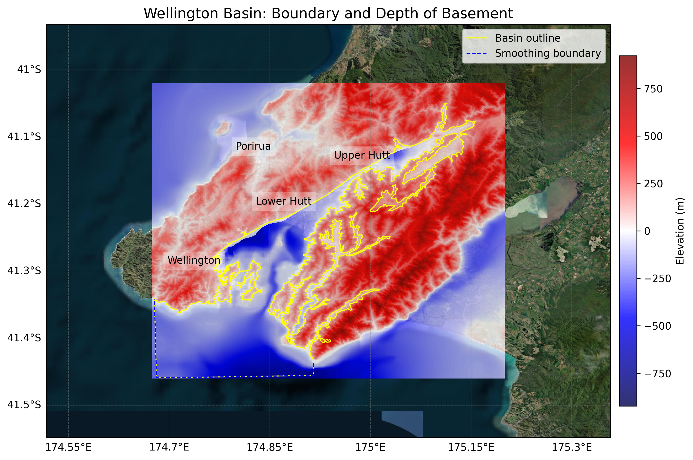
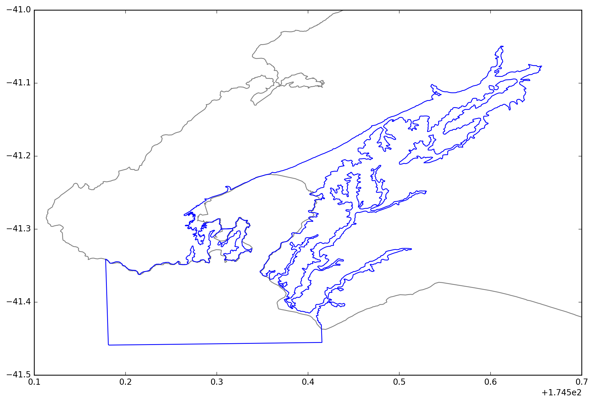

# Basin : Wellington

## Overview
|         |                     |
|---------|---------------------|
| Version | 25p5           |
| Type    | 3        |
| Author  | Robin Lee / Matt Hill            |
| Created | 2025-05           |
| Older Versions | 19p1, 19p6, 21p8 |

## Images

*Figure 1 Location*

*Figure 2 Wellington Basin Map*

*Figure 3 Wellington Outline*

## Notes
- 19.1,19.6 Robin Lee (basement update)
- 21.8 Matt Hill (basement update)
- 25.5 Matt Hill (city extent model combined with regional model)

## Data
### Boundaries
- Wellington_outline_WGS84 : [GeoJSON](Wellington_outline_WGS84.geojson)

### Surfaces
- NZ_DEM_HD :  (Submodel: canterbury1d_v2)
- Wellington_basement_WGS84_v25p5 : [HDF5](Wellington_basement_WGS84_v25p5.h5) (Submodel: N/A)

### Smoothing Boundaries
- [Wellington_smoothing.txt](Wellington_smoothing.txt)

## Older Versions

### 21p8

|         |                     |
|---------|---------------------|
| Version | 21p8  |
| Type    | 3 |
| Author  | Robin Lee / Matt Hill |
| Created | 2021-08       |

**Data:**
*Boundaries:*
- Wellington_outline_WGS84 : [GeoJSON](Wellington_outline_WGS84.geojson)

*Surfaces:*
- NZ_DEM_HD :  (Submodel: canterbury1d_v2)
- Wellington_basement_WGS84_v21p8 : [HDF5](Wellington_basement_WGS84_v21p8.h5) (Submodel: N/A)

*Smoothing Boundaries:*
- [Wellington_smoothing.txt](Wellington_smoothing.txt)

### 19p6

|         |                     |
|---------|---------------------|
| Version | 19p6  |
| Type    | N/A |
| Author  | Unknown |
| Created | 2019-06       |

**Data:**
*Boundaries:*
- Wellington_outline_WGS84 : [GeoJSON](Wellington_outline_WGS84.geojson)

*Surfaces:*
- NZ_DEM_HD :  (Submodel: canterbury1d_v2)
- Wellington_basement_WGS84_v19p6 : [HDF5](Wellington_basement_WGS84_v19p6.h5) (Submodel: N/A)

*Smoothing Boundaries:*
- [Wellington_smoothing.txt](Wellington_smoothing.txt)

### 19p1

|         |                     |
|---------|---------------------|
| Version | 19p1  |
| Type    | N/A |
| Author  | Unknown |
| Created | 2019-01       |

**Data:**
*Boundaries:*
- Wellington_outline_WGS84 : [GeoJSON](Wellington_outline_WGS84.geojson)

*Surfaces:*
- NZ_DEM_HD :  (Submodel: canterbury1d_v2)
- Wellington_basement_WGS84_v19p1 : [HDF5](Wellington_basement_WGS84_v19p1.h5) (Submodel: N/A)

*Smoothing Boundaries:*
- [Wellington_smoothing.txt](Wellington_smoothing.txt)

---
*Page generated on: September 23, 2025, 15:46 NZST/NZDT*
