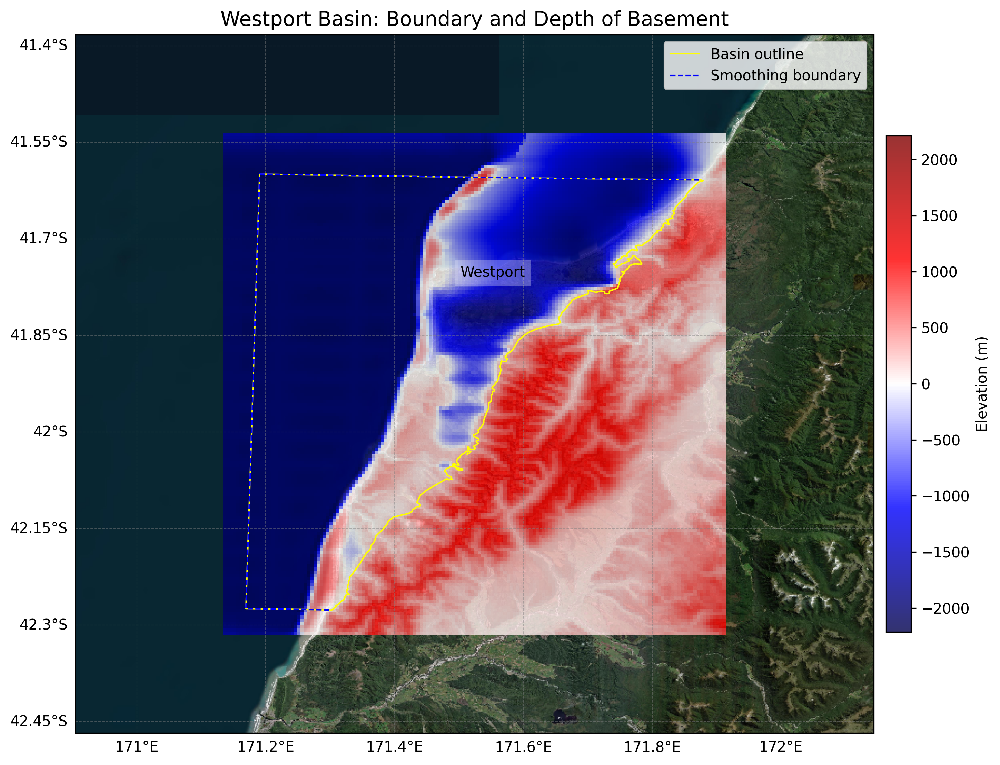

# Basin : Westport

## Overview
|         |                     |
|---------|---------------------|
| Version | 25p5           |
| Type    | 1        |
| Author  | Kaleb Finn / Ayushi Tiwari (ENCN493)            |
| Created | 2025-05           |

## Images

*Figure 1 Location*

## Data
### Boundaries
- Westport_outline_WGS84 : [GeoJSON](regional/Westport/Westport_outline_WGS84.geojson)

### Surfaces
- NZ_DEM_HD : [HDF5](global/surface/NZ_DEM_HD.h5) (Submodel: canterbury1d_v2)
- Westport_basement_WGS84 : [HDF5](regional/Westport/Westport_basement_WGS84.h5) (Submodel: N/A)

### Smoothing Boundaries
- [Westport_smoothing.txt](regional/Westport/Westport_smoothing.txt)

---
*Page generated on: September 02, 2025, 12:43 NZST/NZDT*
