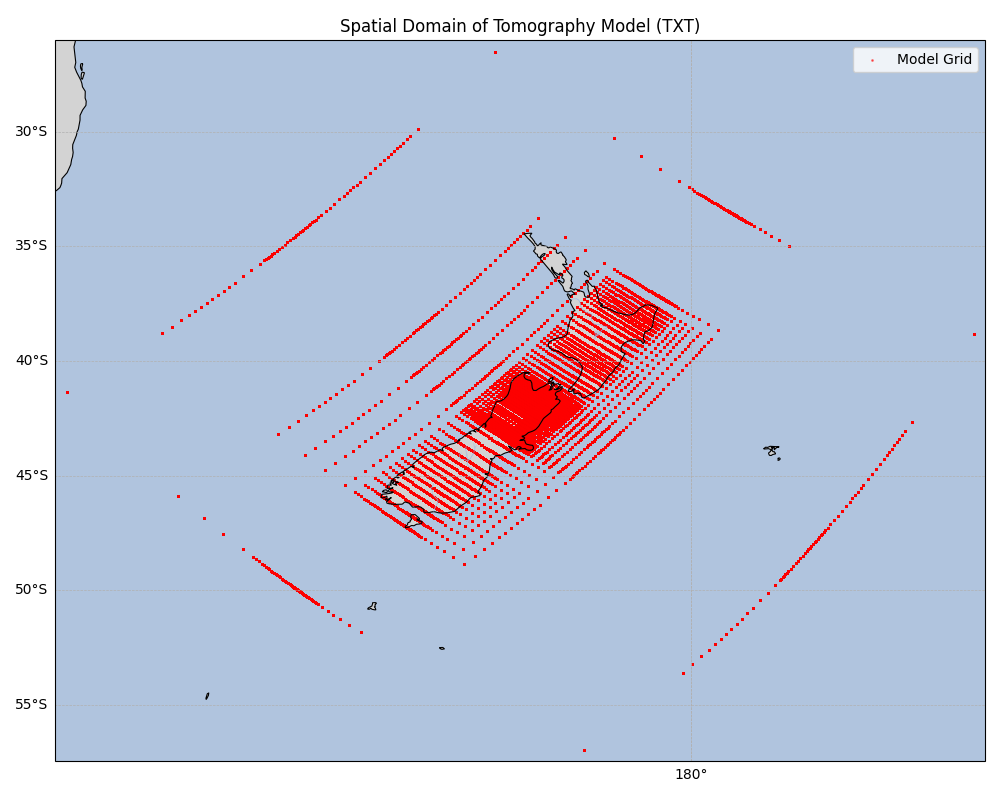
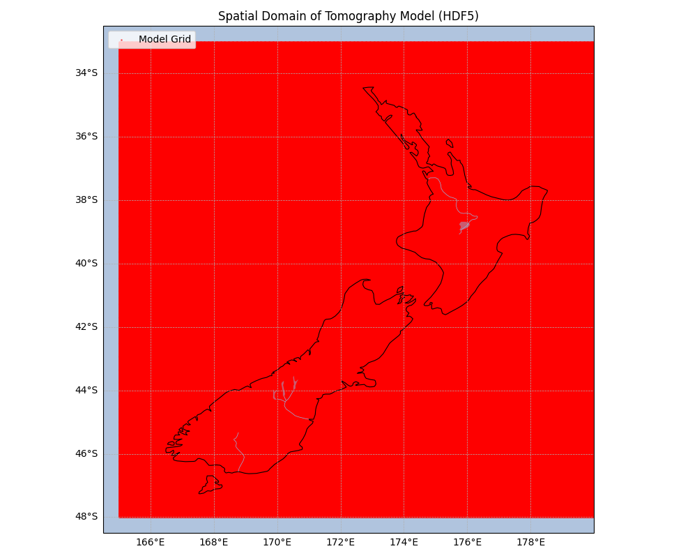

# EP2020 Tomography Model

The EP2020 tomography model, as defined in the NZCVM registry, provides a foundational background velocity structure for New Zealand. It is an essential component for integrating more detailed regional and basin models.

## Model Details

This model is explicitly defined in the `nzcvm_registry.yaml` file, which acts as the central source of truth for its properties:

* **Name:** `EP2020`
* **Author:** Eberhart-Phillips et al. (2020)
* **Title:** New Zealand Wide model 2.2 seismic velocity and Q structure
* **Data Path:** `global/tomography/ep2020.h5`
* **Elevation Layers (`elev`):** The model is defined on 20 discrete elevation layers, specified in kilometers. These layers range from 15 km above sea level down to 750 km below, providing a deep velocity profile.

## Data Integration and Visualization

The raw data for the EP2020 model consists of scattered points of seismic velocity measurements. For use within the 3D velocity model, this data is processed by interpolating these points onto a regular, uniform grid. The interpolated data forms a series of smooth velocity planes at different elevations.

| Original Data (TXT) | Interpolated Data (HDF5) |
|---------------------|--------------------------|
|  |  |

The left panel shows the original tomography dataset in EP2020 ASCII format. Grid points follow the model's rotated coordinate system, producing an irregular pattern of longitudes that cross the dateline. 

The right panel shows the same model after interpolation onto a uniform rectilinear latitude–longitude grid. The interpolated dataset contains 1,120,000 points arranged as 1,400 unique latitudes × 800 unique longitudes, spanning 48°S to 33°S in latitude and 165°E to 180°E in longitude. This regularized grid provides a contiguous New Zealand domain that is directly compatible with 3D visualization and numerical simulations.

## References

* Eberhart-Phillips, D., & Reyners, M. et al. (2020). *New Zealand Wide model 2.2 seismic velocity and Q structure*. New Zealand Journal of Geology and Geophysics.

## Interpolation Process
```angular2html
(venv) (ringo311) seb56@c015kr:~/nzcvm_data/tomography/EP2020$ python ../EP2020/tools/interpolate_to_uniform_nzcvm_grid.py ~/tomo_conversion/EP2020/vlnzw2p2dnxyzltln.tbl.txt ../EP2010/ep2010.h5 ./ep2020_ver2.h5 --extend-lon 5 --fill-value nan
======================================================================
Eberhart-Phillips TOMOGRAPHY INTERPOLATION (IMPROVED)
======================================================================

   Improvements in this version:
   - Configurable fill value for regions outside data coverage
   - Optional longitude extension beyond 180deg meridian
   - All input depth levels retained by default

   Current settings:
   Fill value: NaN
     Using NaN (recommended - avoids boundary artifacts)
   Compression level: 4
   Longitude extension: 5.0deg

   Reading EP-style TXT...
   Found 25 depth levels in input data
   Longitude range: -179.99deg to 179.96deg
   Latitude range: -56.95deg to -26.51deg

   Loading NZCVM grid...
   Extended longitude grid by 5.00deg (267 points)
   New longitude range: 165.00deg to 185.01deg
   Grid: 1400 lat x 1067 lon = 1,493,800 points per level
   Longitude range: 165.00deg to 185.01deg
   Latitude range: -48.00deg to -33.00deg


   Depth compatibility analysis:
   Input data depths: 25 levels
   Reference grid depths: 20 levels
   Common depths: 20
   Input-only depths: [-55.0, -42.0, -34.0, -5.0, -1.0]
   Using ALL depths (input + reference): 25 levels

   Interpolating vp...
   [INFO] Longitude normalization: Using 0-360 deg convention (grid extends to 185.01 deg)
   Interpolating vs...
   [INFO] Longitude normalization: Using 0-360 deg convention (grid extends to 185.01 deg)
   Interpolating rho...
   [INFO] Longitude normalization: Using 0-360 deg convention (grid extends to 185.01 deg)

   Writing to output HDF5...

   NaN statistics (will be stored as -999.0):
      VP:  248,725 / 37,345,000 (0.67%)
      VS:  248,725 / 37,345,000 (0.67%)
      RHO: 248,725 / 37,345,000 (0.67%)

   Writing HDF5 with compression:
   Output: ep2020_ver2.h5
   Grid: 1400 lat x 1067 lon x 25 depth
   Compression: gzip level 4 + shuffle filter
   Uncompressed size estimate: 997.2 MB (0.97 GB)
   Written group '-750' (1/25)
   Written group '-225' (5/25)
   Written group '-85' (10/25)
   Written group '-38' (15/25)
   Written group '-8' (20/25)
   Written group '15' (25/25)

   Successfully saved EP-style HDF5 to ep2020_ver2.h5
   Actual file size: 128.8 MB (0.13 GB)
   Compression ratio: 7.7x
   Space saved: 868.4 MB (0.85 GB)

======================================================================
CONVERSION COMPLETE!
======================================================================

   Notes:
   - NaN values (uncovered regions) are stored as -999.0 in the HDF5 file
   - Use reader/visualization code that recognizes -999.0 as missing data
   - Check coverage statistics above for data quality assessment

```

