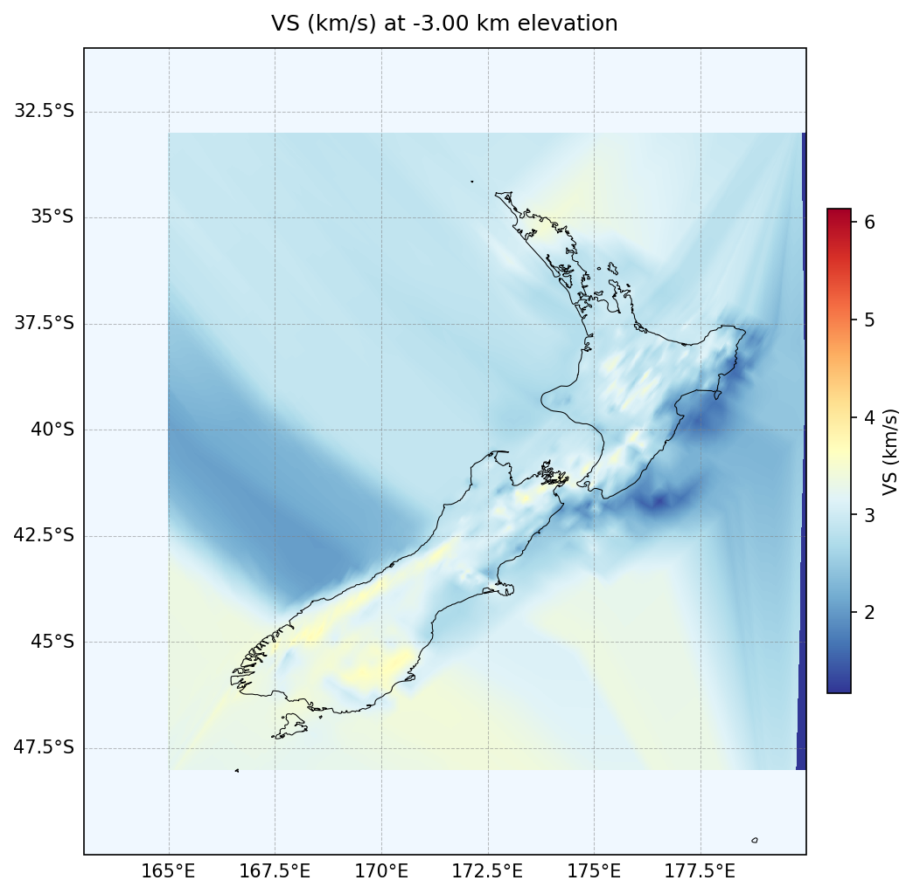
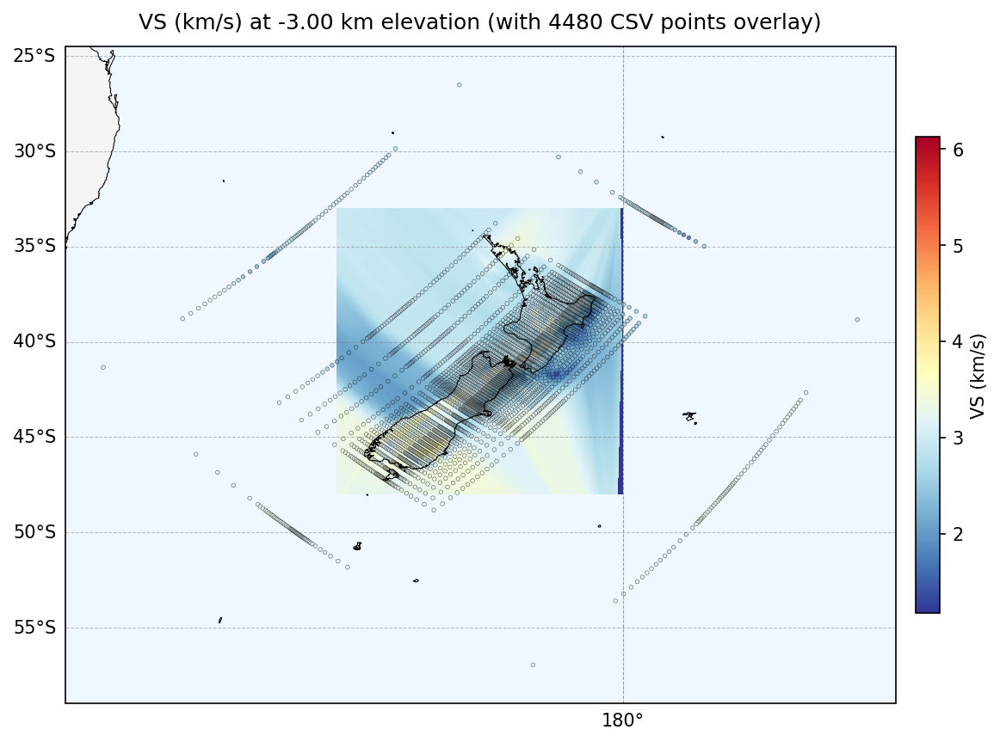
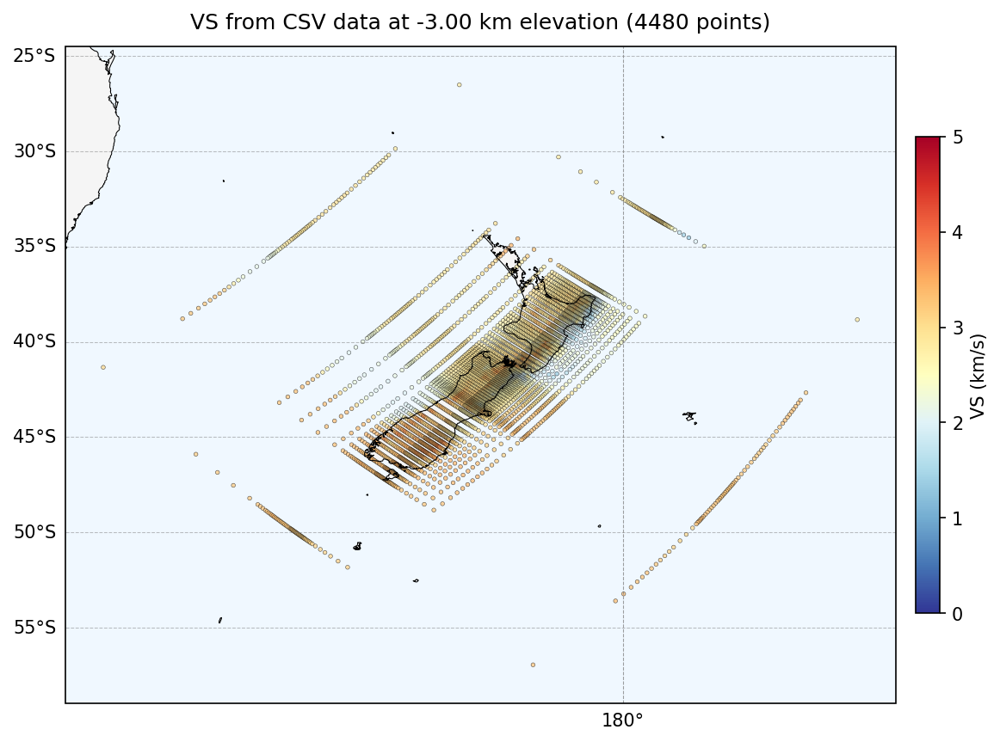
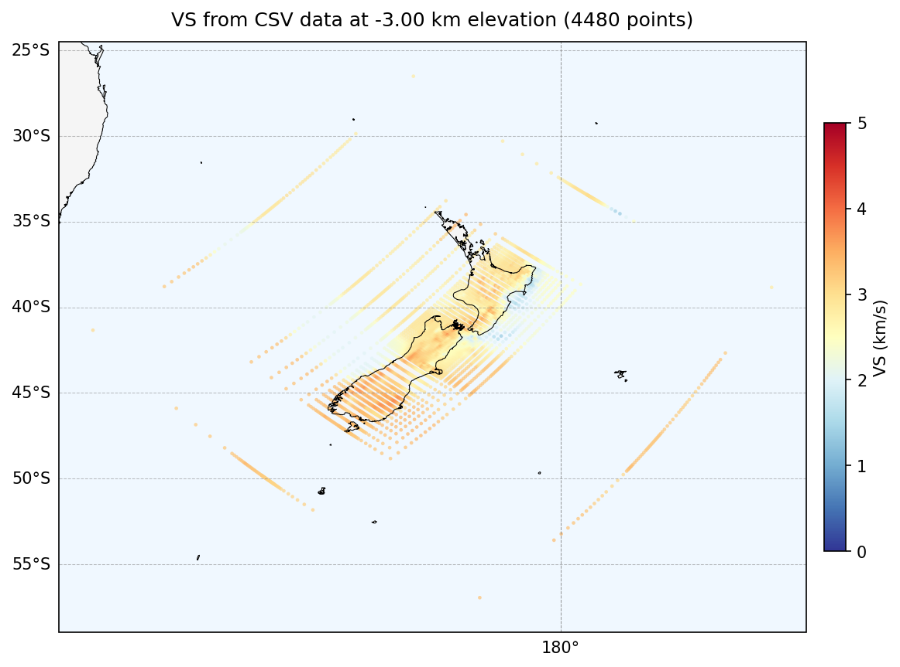
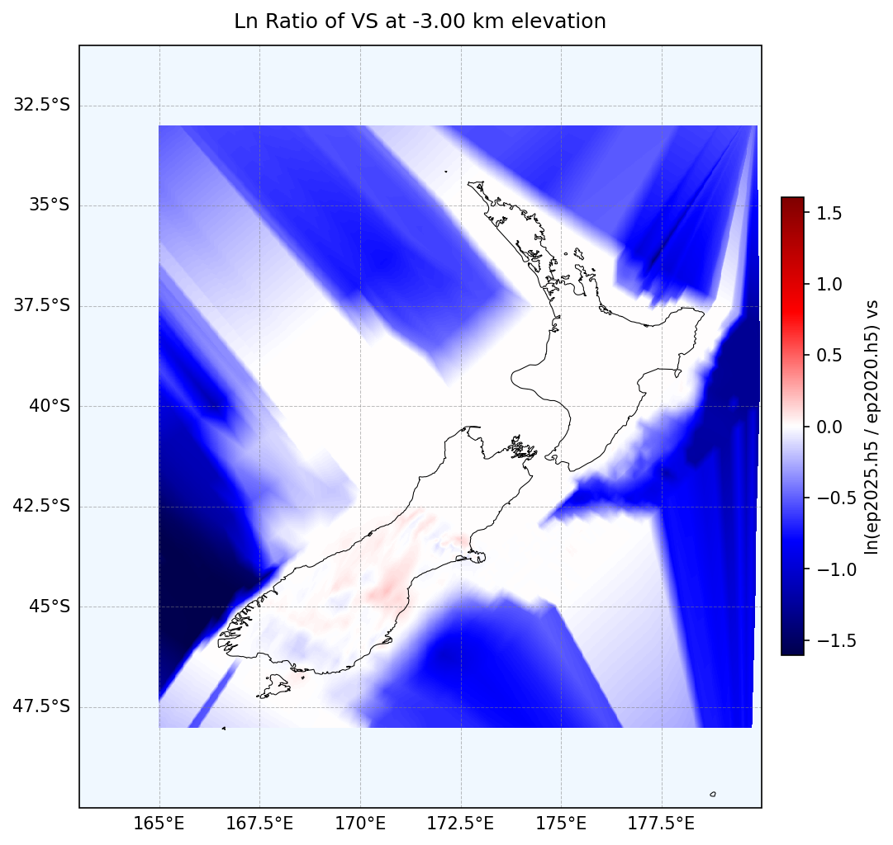

# Tomography 2D Mapper

A comprehensive tool for visualizing seismic tomography data from HDF5 files and CSV data, with support for overlays, comparisons, and international dateline crossing.

## Features

- ✅ **HDF5 Visualization** - Plot velocity models from HDF5 tomography files
- ✅ **CSV Overlay** - Overlay point data from CSV files on HDF5 backgrounds
- ✅ **CSV-Only Mode** - Plot CSV data without requiring HDF5 files
- ✅ **Model Comparison** - Calculate and visualize natural log ratios between two models
- ✅ **Dateline Support** - Properly handles data crossing the international dateline
- ✅ **Auto-Elevation Detection** - Automatically find all elevations in CSV data
- ✅ **Dense Data Support** - Options for clean visualization of thousands of points

## Installation

```bash
pip install h5py pandas numpy matplotlib cartopy
```

## Quick Start Examples

### 1. View HDF5 Model Only

Plot a single scalar field from an HDF5 file:

```bash
python tomo_map.py EP2020/ep2020.h5 \
  --scalar vs \
  --elevations "-3" \
  --output-dir grid_view
```

**Output:**
```
📄 Standard Plot Mode Enabled
📍 Plotting 1 HDF5 elevation slice(s). Output → grid_view
📊 Calculating global vs limits...
   Global range: 1.172 .. 6.130
✅ Saved: grid_view/vs_elev-3.png
```



**When to use:** View your tomography model's spatial distribution and velocity structure.

---

### 2. Overlay CSV Data on HDF5

Compare CSV point data with your HDF5 model:

```bash
python tomo_map.py EP2020/ep2020.h5 \
  --with-csv vlnzw2p2dnxyzltln.tbl.txt \
  --lon-col 10 --lat-col 9 --depth-col 8 --scalar-col 2 \
  --skip-rows 2 --sep '\s+' --scalar vs \
  --elevations "-3" \
  --output-dir overlay_plots
```

**Output:**
```
📍 CSV Overlay Mode Enabled (overlaying CSV on HDF5 data)
📍 Plotting 1 HDF5 elevation slice(s). Output → overlay_plots
📊 Calculating global vs limits...
   Global range: 1.172 .. 6.130
✅ Saved: overlay_plots/overlay_vs_elev-3.png
```



**When to use:** 
- Compare original data points with interpolated model
- Validate model coverage
- Identify data gaps or artifacts

---

### 3. CSV-Only Mode

Plot CSV data without needing an HDF5 file:

```bash
python tomo_map.py \
  --csv-only vlnzw2p2dnxyzltln.tbl.txt \
  --lon-col 10 --lat-col 9 --depth-col 8 --scalar-col 2 \
  --skip-rows 2 --sep '\s+' --scalar vs \
  --elevations "-3" \
  --no-outline-marker \
  --output-dir csv_only
```

**Output:**
```
📍 CSV-Only Mode Enabled (plotting CSV data without HDF5 background)
📊 Using default vs limits: 0.000 .. 5.000
   (Specify --vmin and --vmax to override)

   📋 CSV Parsing Debug Info:
      Separator: '\s+' (use --sep to change)
      First row parsed as: ['2.91', '1.74', '1.68', ...]
   
   📊 Column Mapping:
      Longitude            (--lon             10): found column '171.4354'
      Latitude             (--lat              9): found column '-26.5081'
      Depth/Elevation      (--depth-or-elev   8): found column '-15.00'
      Scalar Value         (--scalar          2): found column '1.68'
   
   Loaded 4480 points from CSV near elevation -3.00 km.
✅ Saved: csv_only/csv_only_vs_elev-3.png
```


*With default outline (dense data looks cluttered)*


*With `--no-outline-marker` (cleaner for dense data)*

**When to use:**
- Visualize raw data distribution
- No HDF5 model available yet
- Debug CSV file loading
- Create figures showing data coverage

---

### 4. Model Comparison (Ln Ratio)

Compare two HDF5 models:

```bash
python tomo_map.py EP2020/ep2020.h5 \
  --compared EP2025/ep2025.h5 \
  --scalar vs \
  --elevations "-3" \
  --output-dir comparison
```

**Output:**
```
📊 Ratio Mode Enabled (ln(compared / base))
   Found 24 common elevations.
📊 Calculating global symmetric Ln Ratio limits for vs...
   Global symmetric range: [-1.604 .. 1.604]
✅ Saved: comparison/ln_ratio_vs_elev-3.png
```



**When to use:**
- Compare model updates or versions
- Identify regions of change
- Quantify model differences
- Red = compared model faster, Blue = compared model slower

---

## Complete Options Reference

### Basic Arguments

```bash
python tomo_map.py [HDF5_FILE] [OPTIONS]
```

**Note:** HDF5_FILE is optional when using `--csv-only`

### CSV Options (Choose ONE)

| Option | Description | Requires HDF5? |
|--------|-------------|----------------|
| `--with-csv FILE` | Overlay CSV on HDF5 background | ✅ Yes |
| `--csv-only FILE` | Plot only CSV data | ❌ No |

### Required CSV Parameters

When using `--with-csv` or `--csv-only`, you must specify:

```bash
--lon-col COL          # Longitude column (name or 0-based index)
--lat-col COL          # Latitude column (name or 0-based index)
--depth-col COL        # Depth/elevation column (name or 0-based index)
--scalar-col COL       # Value column (name or 0-based index)
```

### CSV Parsing Options

| Option | Default | Description |
|--------|---------|-------------|
| `--skip-rows N` | 0 | Skip N header rows |
| `--sep SEP` | `,` | Column separator (use `'\s+'` for whitespace) |
| `--depth-is-elevation` | False | If depth column is elevation (positive up) |
| `--depth-tolerance TOL` | 0.1 | Tolerance (km) for matching CSV to elevations |

### Visualization Options

| Option | Description | Example |
|--------|-------------|---------|
| `--scalar {vp,vs,rho}` | Which field to plot | `--scalar vs` |
| `--elevations E1 E2 ...` | Specific elevations | `--elevations "-10" "-5" "0"` |
| `--auto-elevations` | Auto-detect from CSV | (csv-only mode) |
| `--vmin VALUE` | Min color scale | `--vmin 1.5` |
| `--vmax VALUE` | Max color scale | `--vmax 4.5` |
| `--cmap CMAP` | Colormap name | `--cmap viridis` |
| `--no-outline-marker` | Remove CSV point outlines | (for dense data) |
| `--dpi DPI` | Figure resolution | `--dpi 300` |

### Comparison Options

| Option | Description |
|--------|-------------|
| `--compared FILE` | Compare with second HDF5 file |

**Note:** Cannot combine `--compared` with CSV options

### Other Options

| Option | Description |
|--------|-------------|
| `--output-dir DIR` | Output directory |
| `--no-cartopy` | Use matplotlib only (no map features) |

---

## Understanding CSV Column Indices

**IMPORTANT:** Python uses 0-based indexing!

### Example CSV File Structure

```
# Header row 1
# Header row 2
Vp   Vp/Vs   Vs   Density  ...  Depth   Lat      Lon
2.91  1.74   1.68  2.27    ... -15.00  -26.51   171.44
```

**Column mapping:**
```
Index  Column        Use For
-----  ------        -------
0      Vp            --scalar-col 0 (if plotting Vp)
1      Vp/Vs         
2      Vs            --scalar-col 2 (if plotting Vs)
3      Density       --scalar-col 3 (if plotting density)
...
8      Depth         --depth-col 8
9      Lat           --lat-col 9
10     Lon           --lon-col 10
```

### How to Determine Column Indices

1. **Look at the debug output** - The script shows what it found:
   ```
   📊 Column Mapping:
      Longitude (--lon 10): found column '171.4354'
   ```

2. **Count from 0** - First column is 0, second is 1, etc.

3. **Check first row values** - Debug output shows parsed first row

### Common CSV Formats

**Format 1: Space-separated with headers**
```bash
--skip-rows 2        # Skip 2 header lines
--sep '\s+'          # Use whitespace separator
```

**Format 2: Comma-separated**
```bash
--skip-rows 1        # Skip 1 header line
--sep ','            # Use comma separator (default)
```

**Format 3: Tab-separated**
```bash
--skip-rows 0        # No header to skip
--sep '\t'           # Use tab separator
```

---

## When to Use --no-outline-marker

### Default Behavior (With Outline)
Each CSV point has a small black outline, making individual points visible.

**Good for:** Sparse data (<1000 points per elevation)

**Problem:** Dense data becomes dark and cluttered

### With --no-outline-marker
CSV points are solid color with no outline.

**Good for:** Dense data (>1000 points per elevation)

**Benefit:** Cleaner, brighter visualization

### Visual Comparison

| Data Density | Without Flag | With `--no-outline-marker` |
|--------------|--------------|----------------------------|
| Sparse (<1000 pts) | ✅ Good | ⚠️ Points too faint |
| Dense (>1000 pts) | ❌ Too dark | ✅ Much cleaner |
| Very Dense (>10000 pts) | ❌ Unusable | ✅ Essential |

**Rule of thumb:** If you can't see the colors clearly, add `--no-outline-marker`

---

## Setting Color Scales (--vmin / --vmax)

### Default Behavior

**HDF5 mode:** Automatically calculated from data (2nd to 98th percentile)

**CSV-only mode:** Uses defaults based on scalar type:
- `vs`: 0.0 to 5.0 km/s
- `vp`: 0.0 to 9.0 km/s
- `rho`: 1.0 to 4.0 g/cm³

### When to Override

1. **Emphasize certain velocity ranges:**
   ```bash
   --vmin 2.0 --vmax 4.0  # Focus on sedimentary velocities
   ```

2. **Consistent scales across plots:**
   ```bash
   --vmin 1.5 --vmax 6.0  # Same scale for all elevations
   ```

3. **Better color contrast:**
   ```bash
   --vmin 1.0 --vmax 5.0  # Exclude extreme values
   ```

4. **Match published figures:**
   ```bash
   --vmin 2.5 --vmax 4.5  # Use literature values
   ```

### Examples

**Shallow crustal velocities:**
```bash
--scalar vs --vmin 1.0 --vmax 4.0
```

**Full crustal range:**
```bash
--scalar vs --vmin 2.0 --vmax 5.0
```

**Deep mantle:**
```bash
--scalar vs --vmin 4.0 --vmax 5.5
```

**Density:**
```bash
--scalar rho --vmin 2.0 --vmax 3.5
```

---

## Choosing Colormaps (--cmap)

### Default Colormaps

- **Standard plots:** `RdYlBu_r` (red-yellow-blue, reversed)
- **Ratio plots:** `seismic` (blue-white-red)

### Popular Alternatives

**Perceptually uniform (recommended):**
```bash
--cmap viridis      # Yellow to purple (good for publications)
--cmap plasma       # Pink to yellow
--cmap inferno      # Black to yellow
--cmap cividis      # Blue to yellow (colorblind-friendly)
```

**Sequential:**
```bash
--cmap Blues        # Light to dark blue
--cmap Reds         # Light to dark red
--cmap YlOrRd       # Yellow-orange-red
```

**Diverging:**
```bash
--cmap RdBu         # Red-white-blue
--cmap PuOr         # Purple-white-orange
--cmap BrBG         # Brown-white-teal
```

**Seismic-specific:**
```bash
--cmap seismic      # Blue-white-red (for anomalies)
--cmap coolwarm     # Blue-red (diverging)
```

### Colormap Examples

**For absolute velocities:**
```bash
--cmap viridis      # Best for Vs/Vp
--cmap plasma       # Alternative
```

**For velocity anomalies:**
```bash
--cmap seismic      # Traditional choice
--cmap RdBu_r       # Alternative
```

**For publications:**
```bash
--cmap cividis      # Colorblind-safe
--cmap viridis      # Perceptually uniform
```

**View all matplotlib colormaps:** https://matplotlib.org/stable/gallery/color/colormap_reference.html

---

## Advanced Usage

### Process All Elevations from CSV

Instead of manually listing elevations:

```bash
python tomo_map.py \
  --csv-only data.txt \
  --lon-col 5 --lat-col 6 --depth-col 2 --scalar-col 8 \
  --skip-rows 2 --sep '\s+' --scalar vs \
  --auto-elevations \
  --no-outline-marker \
  --output-dir all_levels
```

Output:
```
🔍 Detecting elevations from CSV file: data.txt...
   Found 23 unique elevations: [10.0, 5.0, 0.0, -5.0, -10.0, ...]
📍 Plotting 23 elevation slices...
```

### High-Resolution Output

For publications:

```bash
python tomo_map.py model.h5 \
  --scalar vs \
  --elevations "-5" \
  --dpi 300 \
  --cmap viridis \
  --vmin 2.0 --vmax 4.5
```

### Multiple Scalars

Create plots for different scalar fields:

```bash
# Vs
python tomo_map.py model.h5 --scalar vs --elevations "-5" --output-dir vs_plots

# Vp
python tomo_map.py model.h5 --scalar vp --elevations "-5" --output-dir vp_plots

# Density
python tomo_map.py model.h5 --scalar rho --elevations "-5" --output-dir rho_plots
```

### Batch Processing

Process multiple elevations:

```bash
python tomo_map.py model.h5 \
  --scalar vs \
  --elevations "-50" "-40" "-30" "-20" "-10" "0" "10" "20" \
  --vmin 2.0 --vmax 5.0 \
  --output-dir depth_series
```

---

## Troubleshooting

### CSV Columns Wrong

**Problem:** Wrong data appears in plots

**Solution:** Check the debug output:
```
📊 Column Mapping:
   Longitude (--lon 10): found column '171.4354'
```

If the found column doesn't match what you expect, adjust your `--lon-col` value.

### Data Not Visible

**Problem:** CSV points too dark or too faint

**Solutions:**
- Add `--no-outline-marker` for dense data
- Adjust `--vmin` and `--vmax` for better contrast
- Try different colormaps with `--cmap`

### Map Cut Off at 180°

**Problem:** Data disappears at international dateline

**Solution:** This is automatically handled! The script detects dateline crossing and uses appropriate projection. If you still see issues, make sure you're using the latest version.

### Separator Not Working

**Problem:** CSV columns not parsed correctly

**Solutions:**
- For space-separated: `--sep '\s+'`
- For tab-separated: `--sep '\t'`
- For comma-separated: `--sep ','` (default)

Check the debug output to verify parsing:
```
📋 CSV Parsing Debug Info:
   Separator: '\s+' (use --sep to change)
   First row parsed as: [...]
```

### Memory Issues with Large CSV

**Problem:** Script crashes with large CSV files

**Solution:** The script reads CSV in chunks automatically. If still having issues:
- Process one elevation at a time
- Reduce the CSV file size
- Increase system memory

### No Elevations Found

**Problem:** "No elevations found in CSV file"

**Solutions:**
- Check `--depth-col` is correct
- Verify `--skip-rows` isn't skipping data
- Ensure depth column has numeric values
- Check if you need `--depth-is-elevation` flag

---

## Tips & Best Practices

### 1. Start with CSV-Only Mode
Before overlaying on HDF5, visualize CSV data alone to verify:
- Column indices are correct
- Data coverage is appropriate
- Color scale is reasonable

### 2. Use Descriptive Output Directories
```bash
--output-dir vs_shallow_crust    # ✅ Good
--output-dir output               # ❌ Not helpful
```

### 3. Save Consistent Color Scales
For comparing multiple plots, always use same `--vmin` and `--vmax`:
```bash
# All plots will be directly comparable
--vmin 2.0 --vmax 4.5
```

### 4. Dense Data = No Outline
If you have >1000 points per elevation:
```bash
--no-outline-marker
```

### 5. Check Debug Output
Always review the column mapping output to verify correct parsing.

### 6. Publication-Ready Figures
For publications:
```bash
--dpi 300 \
--cmap viridis \
--vmin 2.0 --vmax 4.5 \
--no-outline-marker
```

---

## File Outputs

Generated files are named based on mode:

- **HDF5 only:** `{scalar}_elev{elevation}.png`
- **CSV overlay:** `overlay_{scalar}_elev{elevation}.png`
- **CSV only:** `csv_only_{scalar}_elev{elevation}.png`
- **Ratio:** `ln_ratio_{scalar}_elev{elevation}.png`

Example: `overlay_vs_elev-5.00.png`

---

## Support

For issues or questions:
- Check this README first
- Look at the debug output from your command
- Verify column indices are 0-based
- Try CSV-only mode first to isolate problems

---

