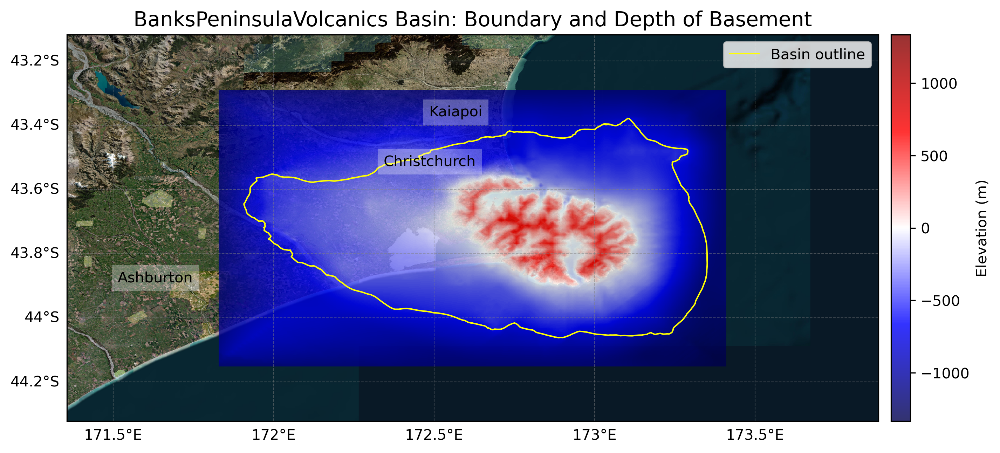

# Basin : BanksPeninsulaVolcanics

## Overview
|         |                     |
|---------|---------------------|
| Version | 19p1           |
| Type    | 4        |
| Author  | Robin Lee            |
| Created | 2019-01           |

## Images

*Figure 1 Location*

*Figure 2 Bankspeninsulavolcanics Basin Map*

## Notes
- Miocene surface is the same as Canterbury

## Data
### Boundaries
- BanksPeninsulaVolcanics_outline_WGS84 : 

### Surfaces
- BanksPeninsulaVolcanics_basement_WGS84 :  (Submodel: bpv_submod_v4)
- BanksPeninsulaVolcanics_Miocene_WGS84 :  (Submodel: N/A)

---
*Page generated on: August 22, 2025, 15:24 NZST/NZDT*
