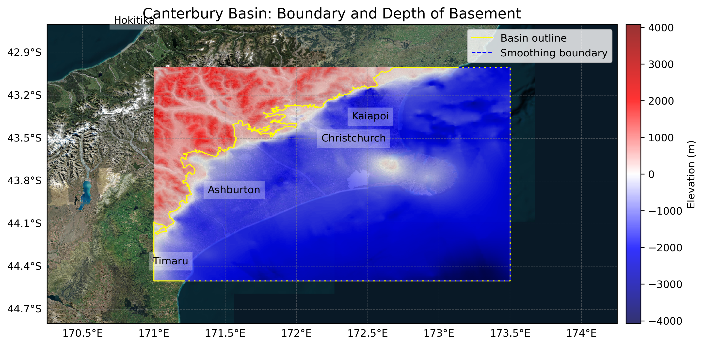

# Basin : Canterbury

## Overview
|         |                     |
|---------|---------------------|
| Version | 19p1           |
| Type    | 4        |
| Author  | Robin Lee            |
| Created | 2019-01           |
| Older Versions | 18p1, 18p2, 18p3 |

## Images

*Figure 1 Location*

*Figure 2 Canterbury Basin Map*

## Notes
- Pre-Quaternary geology

## Data
### Boundaries
- Canterbury_outline_WGS84 : 

### Surfaces
- CantDEM :  (Submodel: canterbury1d_v2_pliocene_enforced)
- Canterbury_Pliocene_46_WGS84_v8p9p18 :  (Submodel: pliocene_submod_v1)
- Canterbury_Miocene_WGS84 :  (Submodel: miocene_submod_v1)
- Canterbury_Paleogene_WGS84 :  (Submodel: paleogene_submod_v1)
- Canterbury_basement_WGS84 :  (Submodel: N/A)

### Smoothing Boundaries
- [Canterbury_smoothing.txt](../../velocity_modelling/data/regional/Canterbury/Canterbury_smoothing.txt)

---
*Page generated on: August 22, 2025, 15:24 NZST/NZDT*
