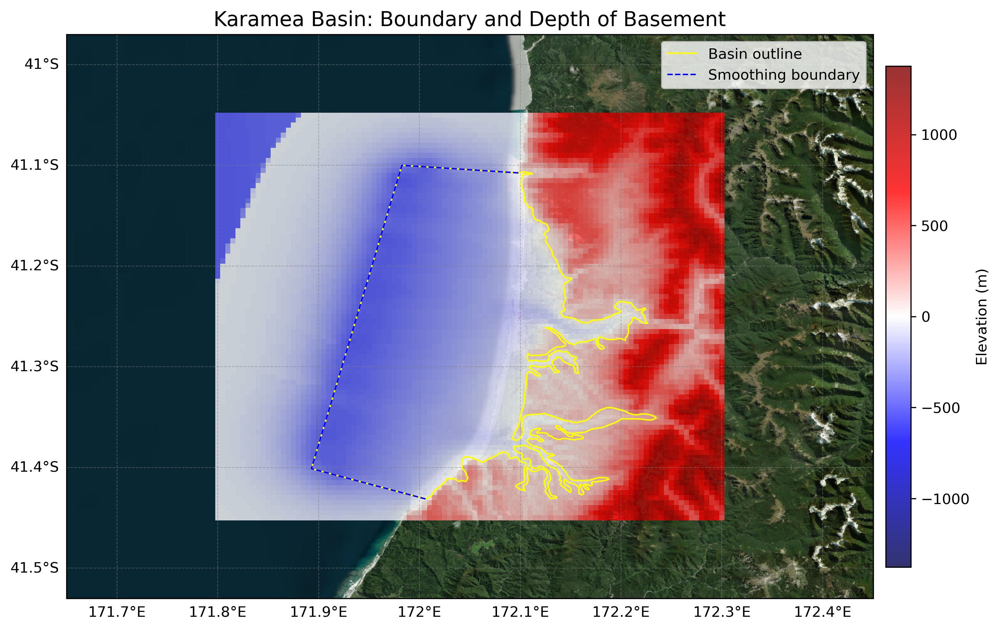

# Basin : Karamea

## Overview
|         |                     |
|---------|---------------------|
| Version | 20p11           |
| Type    | 1        |
| Author  | Tim Tuckey (USER2020)            |
| Created | 2020-11           |

## Images

*Figure 1 Location*

*Figure 2 Karamea Basin Map*

## Data
### Boundaries
- Karamea_outline_WGS84 : 

### Surfaces
- NZ_DEM_HD :  (Submodel: canterbury1d_v2)
- Karamea_basement_WGS84 :  (Submodel: N/A)

### Smoothing Boundaries
- [Karamea_smoothing.txt](../../velocity_modelling/data/regional/Karamea/Karamea_smoothing.txt)

---
*Page generated on: August 22, 2025, 15:24 NZST/NZDT*
