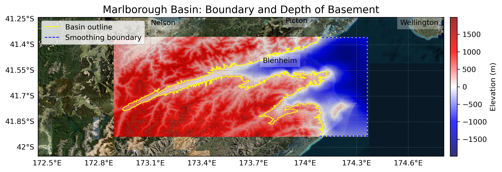

# Basin : Marlborough

## Overview
|         |                     |
|---------|---------------------|
| Version | 19p1           |
| Type    | 1        |
| Author  | Robin Lee            |
| Created | 2019-01           |

## Images

*Figure 1 Location*

*Figure 2 Marlborough Basin Map*

## Data
### Boundaries
- Marlborough_outline_WGS84 : 

### Surfaces
- NZ_DEM_HD :  (Submodel: canterbury1d_v2)
- Marlborough_basement_WGS84 :  (Submodel: N/A)

### Smoothing Boundaries
- [Marlborough_smoothing.txt](../../velocity_modelling/data/regional/Marlborough/Marlborough_smoothing.txt)

---
*Page generated on: August 22, 2025, 15:24 NZST/NZDT*
