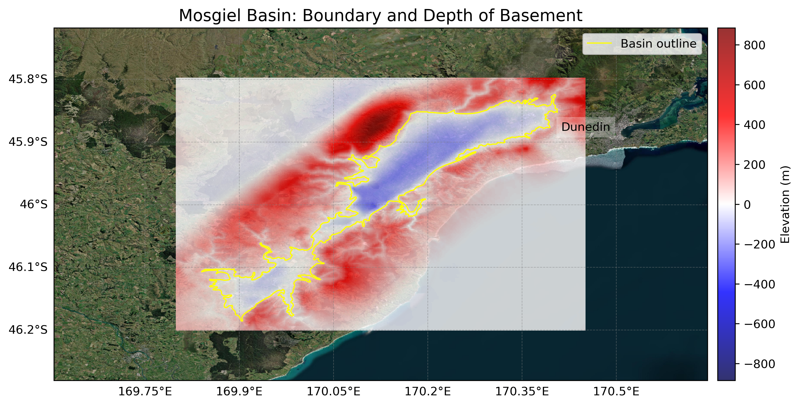
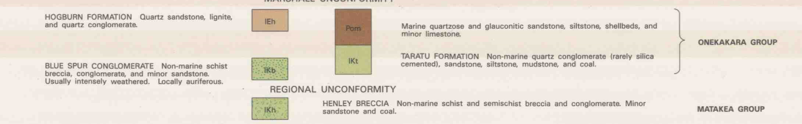
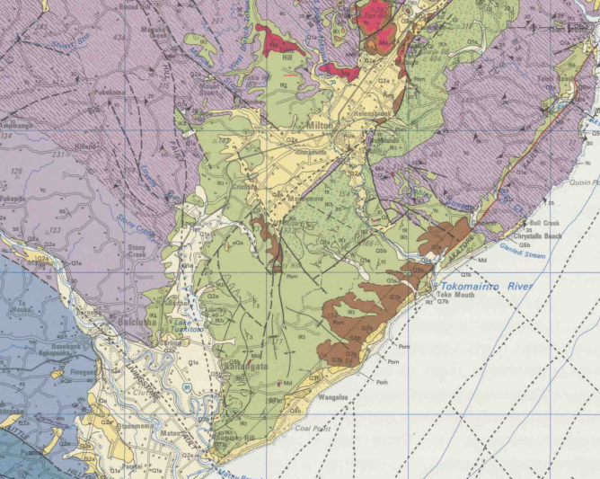

# Basin : Mosgiel

## Overview
|         |                     |
|---------|---------------------|
| Version | 20p7           |
| Type    | 1        |
| Author  | Cameron Douglas (USER2020)            |
| Created | 2020-07           |

## Images

*Figure 1 Location*

*Figure 2 Mosgiel Basin Map*

*Figure 3 Green Class*

*Figure 4 Green Rock*

## Notes
- Green area (in green_rock.png) tentatively regarded as a sedimentary rock (soft rock)
- Implemented as two separate basins (Mosgiel/Balclutha) joined by the sedimentary rock
- May need more rigorous classification

## Data
### Boundaries
- Mosgiel_outline_WGS84 : 

### Surfaces
- NZ_DEM_HD :  (Submodel: canterbury1d_v2)
- Mosgiel_basement_WGS84 :  (Submodel: N/A)

---
*Page generated on: August 22, 2025, 15:24 NZST/NZDT*
