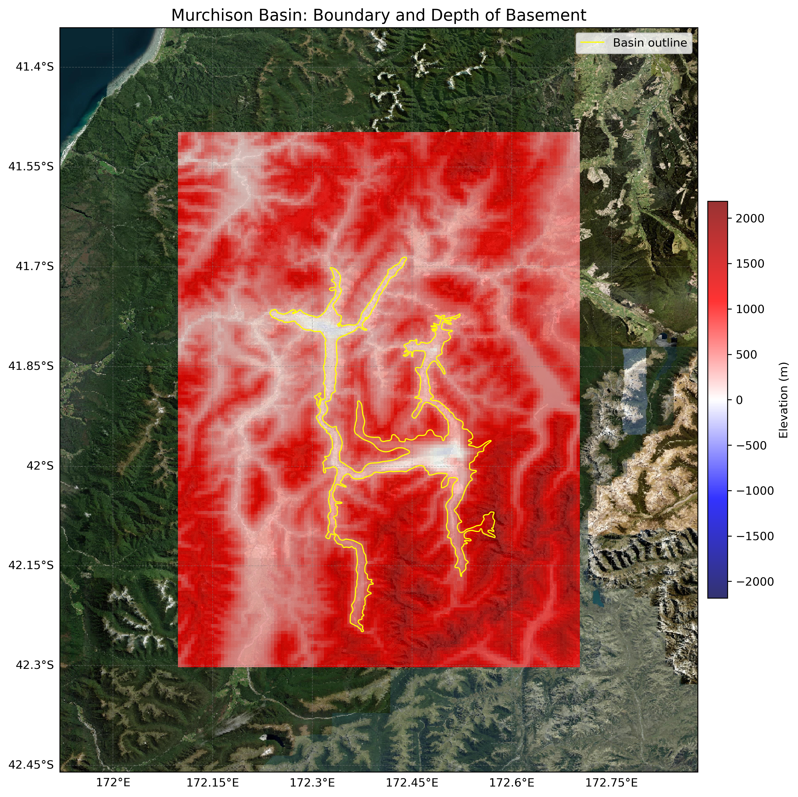
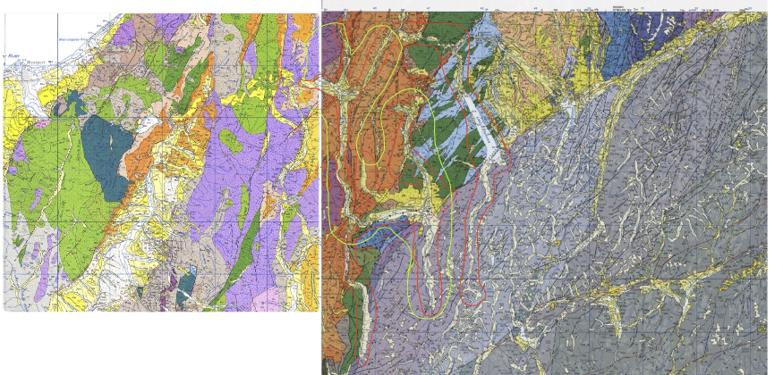

# Basin : Murchison

## Overview
|         |                     |
|---------|---------------------|
| Version | 20p7           |
| Type    | 1        |
| Author  | Tim Tuckey (USER2020)            |
| Created | 2020-07           |

## Images

*Figure 1 Location*

*Figure 2 Murchison Basin Map*

*Figure 3 Murchison Outline*

## Data
### Boundaries
- Murchison_outline_WGS84 : [GeoJSON](../../regional/Murchison/Murchison_outline_WGS84.geojson)

### Surfaces
- NZ_DEM_HD : [HDF5](../../global/surface/NZ_DEM_HD.h5) (Submodel: canterbury1d_v2)
- Murchison_basement_WGS84 : [HDF5](../../regional/Murchison/Murchison_basement_WGS84.h5) (Submodel: N/A)

---
*Page generated on: September 02, 2025, 09:14 NZST/NZDT*
