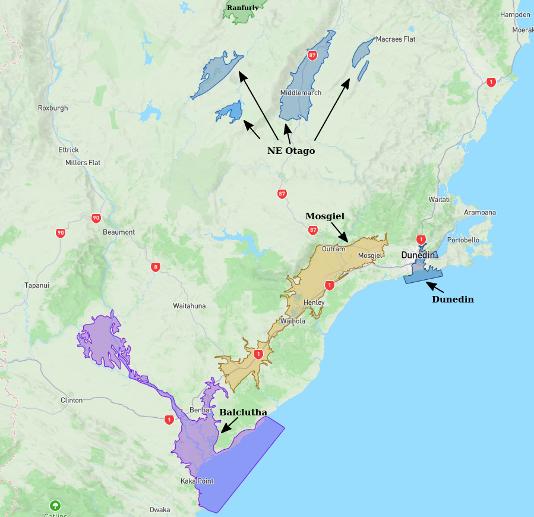

# Basin : NE_Otago

## Overview
|         |                     |
|---------|---------------------|
| Version | 20p7           |
| Type    | 1        |
| Author  | Cameron Douglas (USER2020)            |
| Created | 2020-07           |

## Images

*Figure 1 Location*

*Figure 2 Ne Otago Basin Map*

*Figure 3 Ne Otago Basins Classification-page-001*

## Notes
- Alexandra, Ranfurly and NE_Otago share the same basement

## Data
### Boundaries
- NE_Otago_outline_WGS84_1 : 
- NE_Otago_outline_WGS84_2 : 
- NE_Otago_outline_WGS84_3 : 
- NE_Otago_outline_WGS84_4 : 
- NE_Otago_outline_WGS84_5 : 

### Surfaces
- NZ_DEM_HD :  (Submodel: canterbury1d_v2)
- NE_Otago_basement_WGS84 :  (Submodel: N/A)

---
*Page generated on: August 22, 2025, 15:24 NZST/NZDT*
