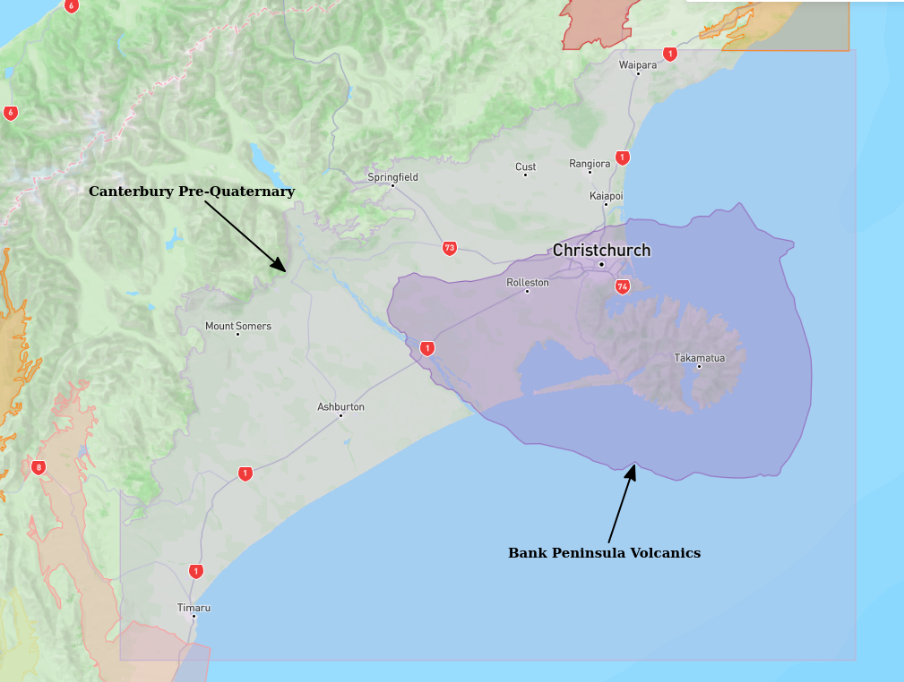

# Basin : NorthCanterbury

## Overview
|         |                     |
|---------|---------------------|
| Version | 25p8           |
| Type    | 1        |
| Author  | Robin Lee            |
| Created | 2025-08           |
| Older Versions | 19p1 |

## Images

*Figure 1 Location*

*Figure 2 Northcanterbury Basin Map V25p8*

## Data
### Boundaries
- NorthCanterbury_outline_WGS84_v25p8 : 

### Surfaces
- NZ_DEM_HD :  (Submodel: canterbury1d_v2)
- NorthCanterbury_basement_WGS84_v25p8 :  (Submodel: N/A)

---
*Page generated on: August 22, 2025, 15:24 NZST/NZDT*
