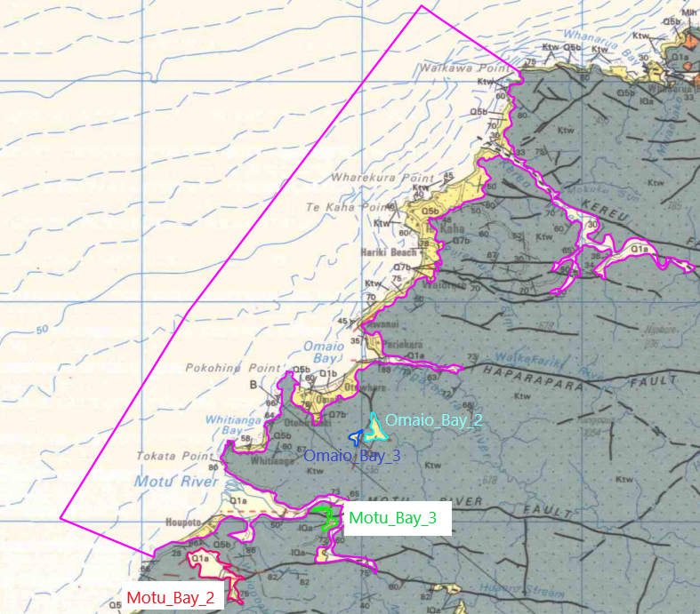

# Basin : OmaioBay

## Overview
|         |                     |
|---------|---------------------|
| Version | 25p5           |
| Type    | 1        |
| Author  | Cameron Davis / Emma Coumbe (USER2022)            |
| Created | 2025-05           |
| Older Versions | 22p3 |

## Images

*Figure 1 Location*

*Figure 2 Omaiobay Basin Map*

*Figure 3 Moturiver Extended Outline*

*Figure 4 Eastcape Coastal River Valleys*

## Data
### Boundaries
- OmaioBay_outline_WGS84_1 : [GeoJSON](../../regional/OmaioBay/OmaioBay_outline_WGS84_1.geojson)
- OmaioBay_outline_WGS84_2 : [GeoJSON](../../regional/OmaioBay/OmaioBay_outline_WGS84_2.geojson)
- OmaioBay_outline_WGS84_3 : [GeoJSON](../../regional/OmaioBay/OmaioBay_outline_WGS84_3.geojson)
- OmaioBay_outline_WGS84_4 : [GeoJSON](../../regional/OmaioBay/OmaioBay_outline_WGS84_4.geojson)
- OmaioBay_outline_WGS84_5 : [GeoJSON](../../regional/OmaioBay/OmaioBay_outline_WGS84_5.geojson)

### Surfaces
- NZ_DEM_HD : [HDF5](../../global/surface/NZ_DEM_HD.h5) (Submodel: canterbury1d_v2)
- OmaioBay_basement_WGS84 : [HDF5](../../regional/OmaioBay/OmaioBay_basement_WGS84.h5) (Submodel: N/A)

### Smoothing Boundaries
- [OmaioBay_smoothing.txt](../../regional/OmaioBay/OmaioBay_smoothing.txt)

---
*Page generated on: September 02, 2025, 09:14 NZST/NZDT*
