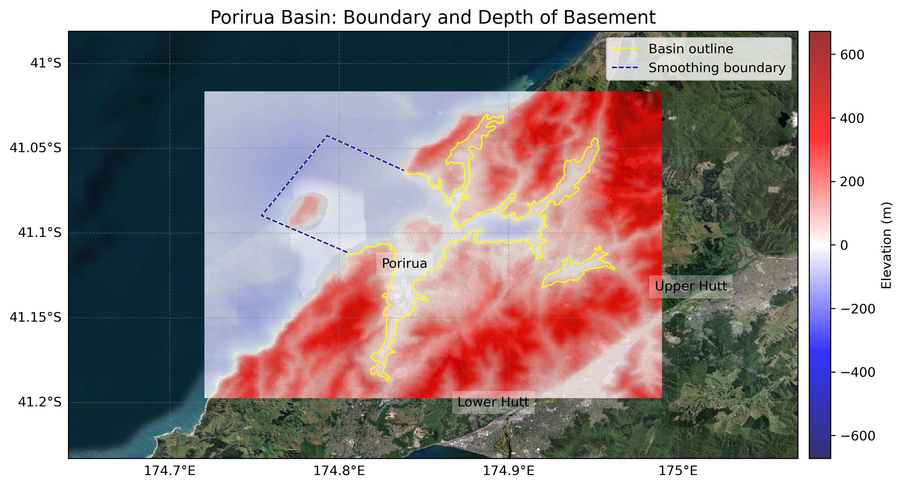
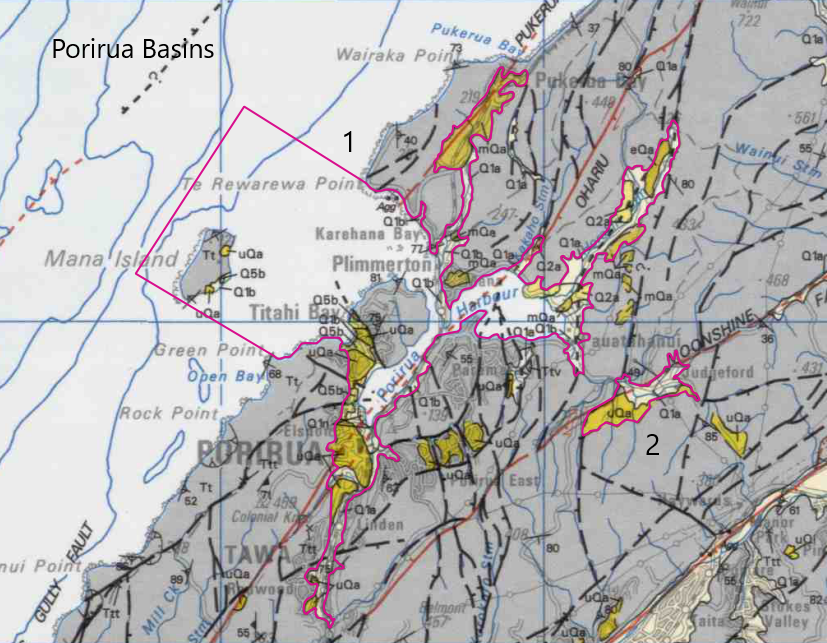

# Basin : Porirua

## Overview
|         |                     |
|---------|---------------------|
| Version | 21p7           |
| Type    | 1        |
| Author  | William Lee (USER2021)            |
| Created | 2021-07           |

## Images

*Figure 1 Location*

*Figure 2 Porirua Basin Map*

*Figure 3 Porirua Outline*

## Data
### Boundaries
- Porirua_outline_WGS84_1 : 
- Porirua_outline_WGS84_2 : 

### Surfaces
- NZ_DEM_HD :  (Submodel: canterbury1d_v2)
- Porirua_basement_WGS84 :  (Submodel: N/A)

### Smoothing Boundaries
- [Porirua_smoothing.txt](../../velocity_modelling/data/regional/Porirua/Porirua_smoothing.txt)

---
*Page generated on: August 22, 2025, 15:24 NZST/NZDT*
