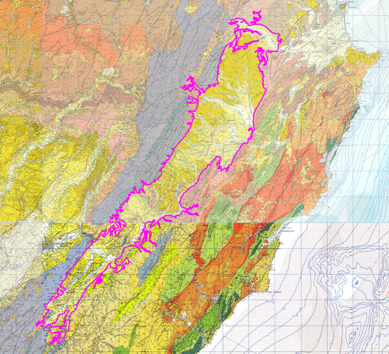
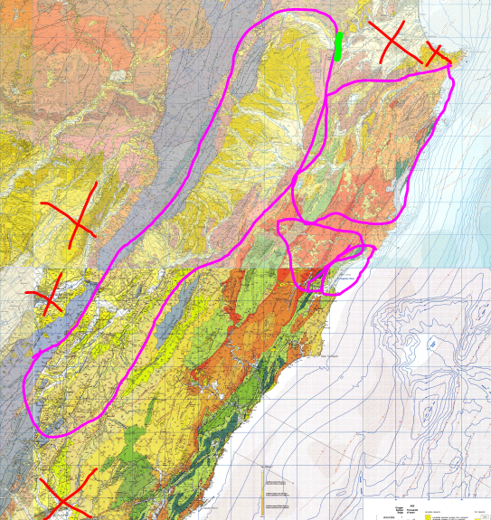

# Basin : SouthernHawkesBay

## Overview
|         |                     |
|---------|---------------------|
| Version | 21p12           |
| Type    | 1        |
| Author  | William Lee (USER2021)            |
| Created | 2021-12           |

## Images

*Figure 1 Location*

*Figure 2 Southernhawkesbay Basin Map*

*Figure 3 Southern Hawkes Bay Outline*

*Figure 4 Southern Hawkes Bay Outline Extra*

## Notes
- (Comment from the author)
- Will be near the Wairarapa and Manawatu-Whanganui / Taranaki basins, but does not physically touch due to rock.
- Physically connects to Northern Hawkes Bay in the Ngaruroro River valley. Need to check consistency in the bedrock surfaces at the intersection.
- Missing some parts in the east coast.

## Data
### Boundaries
- SouthernHawkesBay_outline_WGS84 : 

### Surfaces
- NZ_DEM_HD :  (Submodel: canterbury1d_v2)
- SouthernHawkesBay_basement_WGS84 :  (Submodel: N/A)

---
*Page generated on: August 22, 2025, 15:24 NZST/NZDT*
