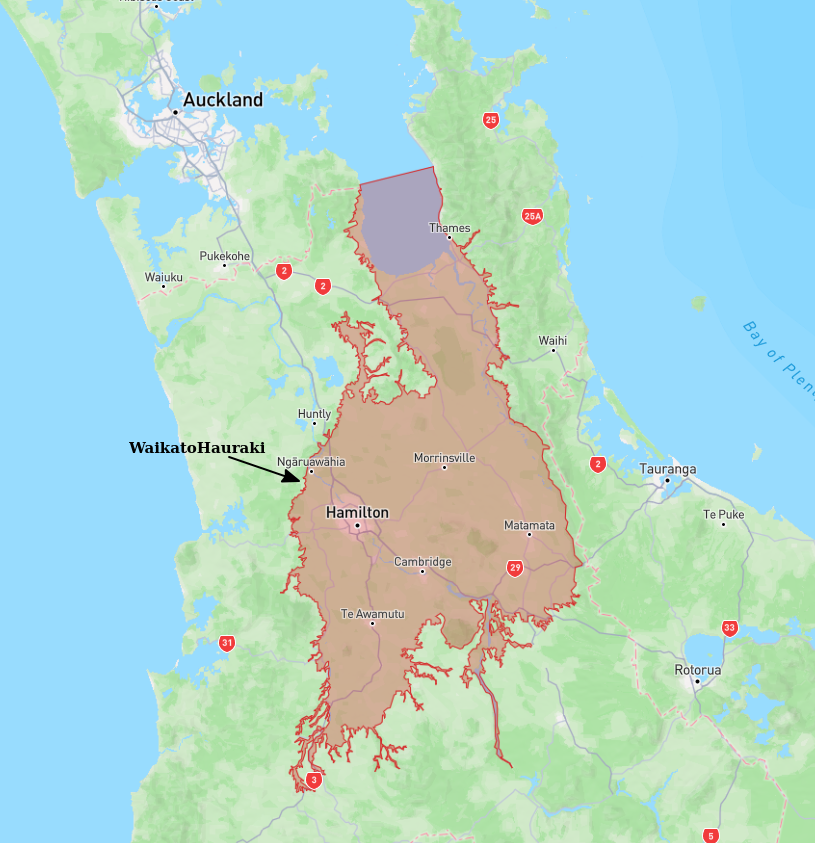

# Basin : WaikatoHauraki

## Overview
|         |                     |
|---------|---------------------|
| Version | 19p7           |
| Type    | 1        |
| Author  | Andrew Stolte            |
| Created | 2019-07           |

## Images

*Figure 1 Location*

*Figure 2 Waikatohauraki Basin Map*

*Figure 3 Waikato Hauraki Outline*

## Data
### Boundaries
- WaikatoHauraki_outline_WGS84 : 

### Surfaces
- NZ_DEM_HD :  (Submodel: canterbury1d_v2)
- WaikatoHauraki_basement_WGS84 :  (Submodel: N/A)

### Smoothing Boundaries
- [WaikatoHauraki_smoothing.txt](../../velocity_modelling/data/regional/WaikatoHauraki/WaikatoHauraki_smoothing.txt)

---
*Page generated on: August 22, 2025, 15:24 NZST/NZDT*
