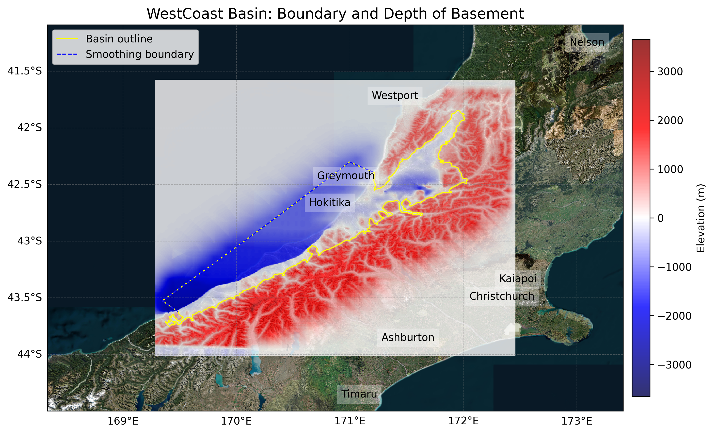

# Basin : WestCoast

## Overview
|         |                     |
|---------|---------------------|
| Version | 25p5           |
| Type    | 1        |
| Author  | Ayhshi Tiwari / Hunter Brotherston            |
| Created | 2025-05           |

## Images

*Figure 1 Location*

## Data
### Boundaries
- WestCoast_outline_WGS84 : [GeoJSON](../../regional/WestCoast/WestCoast_outline_WGS84.geojson)

### Surfaces
- NZ_DEM_HD : [HDF5](../../global/surface/NZ_DEM_HD.h5) (Submodel: canterbury1d_v2)
- WestCoast_basement_WGS84 : [HDF5](../../regional/WestCoast/WestCoast_basement_WGS84.h5) (Submodel: N/A)

### Smoothing Boundaries
- [WestCoast_smoothing.txt](../../regional/WestCoast/WestCoast_smoothing.txt)

---
*Page generated on: September 02, 2025, 09:14 NZST/NZDT*
