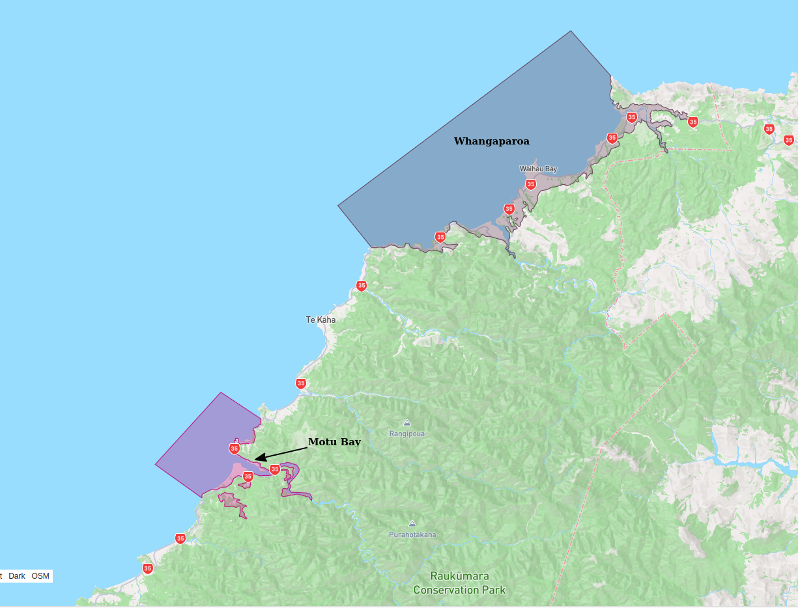

# Basin : Whangaparoa

## Overview
|         |                     |
|---------|---------------------|
| Version | 23p4           |
| Type    | 1        |
| Author  | Cameron Davis / Emma Coumbe (USER2022)            |
| Created | 2023-04           |

## Images

*Figure 1 Location*

*Figure 2 Whangaparoa Basin Map*

## Notes
- See [OmaioBay](OmaioBay.md) for additional notes

## Data
### Boundaries
- Whangaparoa_outline_WGS84 : 

### Surfaces
- NZ_DEM_HD :  (Submodel: canterbury1d_v2)
- Whangaparoa_basement_WGS84 :  (Submodel: N/A)

### Smoothing Boundaries
- [Whangaparoa_smoothing.txt](../../velocity_modelling/data/regional/Whangaparoa/Whangaparoa_smoothing.txt)

---
*Page generated on: August 22, 2025, 15:24 NZST/NZDT*
